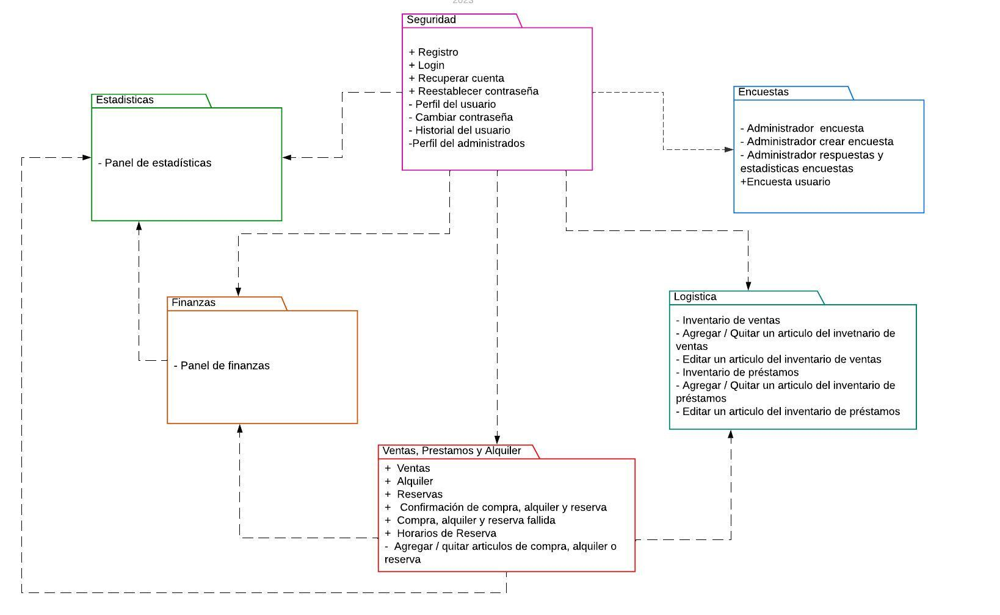

# ENTREGABLE N°4
## 1. Índices y otros objetos de BD
**VISTAS:**

**-Módulo Seguridad:** En el módulo seguridad se utilizaron 2 vistas para simplificar los querys de reportes que se presentan en el perfil del usuario y el perfil del administrador. Estas vistas nos ayudan a hacer más sencillo el llamado de la consulta al momento de realizar el backend de la pagina web, en lugar de realizar consultas complejas que involucren múltiples tablas se puede realizar una consulta más simple a la vista.

- QUERY PERFIL DEL USUARIO
 
      CREATE VIEW REPORTE_FULL_U AS
      	SELECT  
          Ar.Nombre_articulo AS Nombre_producto,
          Ar.Tipo_articulo AS Tipo_servicio,
          A.Fecha_alquiler AS Fecha_operacion,
          A.Hora_inicio,
          A.Hora_fin,
      	NULL AS Fecha_devolucion,
      	A.Monto,
          A.Estado_alquiler AS Estado_operacion,
      	A.Id_usuario
      	FROM
      		Alquiler A
      	INNER JOIN
      		 Usuario U ON A.Id_usuario = U.Id_usuario
      	INNER JOIN
      		Articulo Ar ON A.Id_articulo = Ar.Id_articulo
        
      	UNION
       
      	SELECT
      		Ar.Nombre_articulo AS Nombre_producto,
      		Ar.Tipo_articulo AS Tipo_servicio,
      		P.Fecha_prestamo AS Fecha_operacion,
      		P.Hora_prestamo AS Hora_inicio, 
      		P.Hora_devolucion  As Hora_fin,
      		P.Fecha_devolucion, 
      		NULL AS Monto,
      		P.Estado_prestamo AS Estado_operacion,
      		 P.Id_usuario
      	FROM
      		Prestamo P
      	INNER JOIN
      		Usuario U ON P.Id_usuario = U.Id_usuario
      	INNER JOIN
      		Articulo Ar ON P.Id_articulo = Ar.Id_articulo
      
      	UNION
      
      	SELECT
      		A.Nombre_articulo AS Nombre_producto,
      		A.Tipo_articulo AS Tipo_servicio,
      		V.Fecha_venta AS Fecha_operacion,
      		NULL AS Hora_inicio,
      		NULL AS Hora_fin,
      		NULL AS Fecha_devolucion,
      		A.Precio_unitario AS Monto,
      		V.Estado_pago AS Estado_operacion,
      		U.Id_usuario
      	FROM
      		Detalle_venta DV
      	INNER JOIN
      		Venta V ON DV.Id_venta = V.Id_venta
      	INNER JOIN
      		Articulo A ON DV.Id_articulo = A.Id_articulo
      	INNER JOIN
      		Usuario U ON V.Id_usuario = U.Id_usuario;
      
      
      SELECT * FROM REPORTE_FULL_U
      WHERE Id_usuario  = '1' ;

- QUERY PERFIL DEL ADMINISTRADOR
  
      CREATE VIEW REPORTE_ADMI AS
        SELECT  
            Ar.Nombre_articulo AS Nombre_producto,
            Ar.Tipo_articulo AS Tipo_servicio,
            A.Fecha_alquiler AS Fecha_operacion,
            A.Hora_inicio,
            A.Hora_fin,
        	NULL AS Fecha_devolucion,
        	A.Monto,
            A.Estado_alquiler AS Estado_operacion,
        	A.Medio_pago
        FROM
            Alquiler A
        INNER JOIN
            Articulo Ar ON A.Id_articulo = Ar.Id_articulo
      
        UNION
        
        SELECT
            Ar.Nombre_articulo AS Nombre_producto,
            Ar.Tipo_articulo AS Tipo_servicio,
            P.Fecha_prestamo AS Fecha_operacion,
            P.Hora_prestamo AS Hora_inicio, 
        	P.Hora_devolucion  As Hora_fin,
            P.Fecha_devolucion, 
        	NULL AS Monto,
            P.Estado_prestamo AS Estado_operacion,
        	NULL AS Medio_pago
        FROM
            Prestamo P
        INNER JOIN
            Articulo Ar ON P.Id_articulo = Ar.Id_articulo
        	
        UNION
        
        SELECT
            A.Nombre_articulo AS Nombre_producto,
            A.Tipo_articulo AS Tipo_servicio,
            V.Fecha_venta AS Fecha_operacion,
        	NULL AS Hora_inicio,
        	NULL AS Hora_fin,
        	NULL AS Fecha_devolucion,
            A.Precio_unitario AS Monto,
            V.Estado_pago AS Estado_operacion,
        	DV.Medio_pago
        FROM
            Detalle_venta DV
        INNER JOIN
            Venta V ON DV.Id_venta = V.Id_venta
        INNER JOIN
            Articulo A ON DV.Id_articulo = A.Id_articulo;
      
        SELECT * FROM REPORTE_ADMI;

## 2. PL/pgSQL – Proceso Batch
- Procedimiento para generar los horarios de reservas de la semana

        CREATE OR REPLACE PROCEDURE generate_calendario(fecha date)
        LANGUAGE PLPGSQL
        AS
        $$
        declare 
        	fecha_actual date;
        begin
        	for aumento_fecha in 0..6 loop
        		fecha_actual := fecha + aumento_fecha;
        		if EXTRACT(dow from fecha_actual) not in (0) then
        			if EXTRACT(dow from fecha_actual) not in (6) then
        				for id in 1..14 loop
        					insert into Calendario(Id_hora, Fecha, Hora_inicio, Hora_fin , Estado) values
        					(id, fecha_actual, ('08:00:00'::time + (id - 1) * interval '1 hour')::time, ('08:00:00'::time + (id) * interval '1 hour')::time,'Disponible');
        				end loop;
        			else
        				for id in 1..12 loop
        					insert into Calendario(Id_hora, Fecha, Hora_inicio, Hora_fin , Estado) values
        					(id, fecha_actual, ('08:00:00'::time + (id - 1) * interval '1 hour')::time, ('08:00:00'::time + (id) * interval '1 hour')::time,'Disponible');
        				end loop;			
        			end if;
        		end if;
        	end loop;
        END;
        $$

- Llamar al procedimiento generate_calendario
  
        DO
        $$
        BEGIN
        	call generate_calendario(<FECHA>);
        END;
        $$

## 3.Actualizaciones a la Arquitectura de la Aplicación
**- Estructura de la aplicación:**  La estructura de la aplicación cuenta con la interaccion de todos los modulos que se crearon al principio en base a la funcionalidad de los requerimientos.

**- Tecnología utilizada:** 

**Backend**
- Base de Datos
  
   1. Postgres SQL :
     Elijimos el gestor PostgresSQL debido a que en el grupo habian integrantes que ya conocían la sintaxis para este gestor.
     
- Lenguaje de programación
  
  1. Python: Se seleccionó python para el desarollo de la pagina web debido a que es un lenguaje de programación que todos los integrantes del grupo conocemos y eso facilitaría la participación de todos al momento de desarrollar el backend.
     
     
- Frameworks

  1. Flask: Se selecciono Flask como framework web de python para el backend ya que es un framework que permite crear aplicaciones web de manera rápida y sencilla, por lo que la documentació facil de leer y entender y la facilidad de implementarla en el proyecto.

- Librerias
  
  1. Psycopg2
  2. Flask
  3. python-decouple
  4. python-dotenv
  5. Flask-Cors

**Frontend**

- Lenguajes
  
  1. HTML: HTML es el lenguaje principal para la web, el lenguaje de etiquetas, aunque se utilize una librería como React, se sigue utilizando HTML para la estructura de la página.
     
  3. CSS : CSS es el lenguaje de estilos, el cual se utiliza para darle estilo a la página web, como colores, tamaños, etc.
     
  5. JavaScript : React, trabaja con JavaScript, por lo que es necesario conocerlo para poder utilizar React.

- Frameworks

  1. React: Se seleccionó React como framework web, debido a que es uno de los más usados actualmente, además que permite una creación de paginas web de manera sencilla y ordenada a través de componentes.

- Liberias
  
  1. React-Dom

## 4. Versión Final de la Aplicación

**Link del repositorio:**  [Pagina CEIIS](https://github.com/Dafi-18/Proyecto_DBD_Grupo3)

## 5. Próximos Pasos
  Como próximos pasos tenemos planeado agregar nuevas funcionalidades como por ejemplo, la de exportar los reportes con fines de auditoría, añadir e implementar los medios de pagos virtuales en la aplicación. También tenemos planeado rediseñar esta aplicación para que tenga soporte en celulares y tablets. Por último, implementar y adaptar nuestro aplicación a las reglas y políticas del CEIIS en el paso del tiempo. Buscamos la mejora continua de nuestro sistema a través del tiempo.
