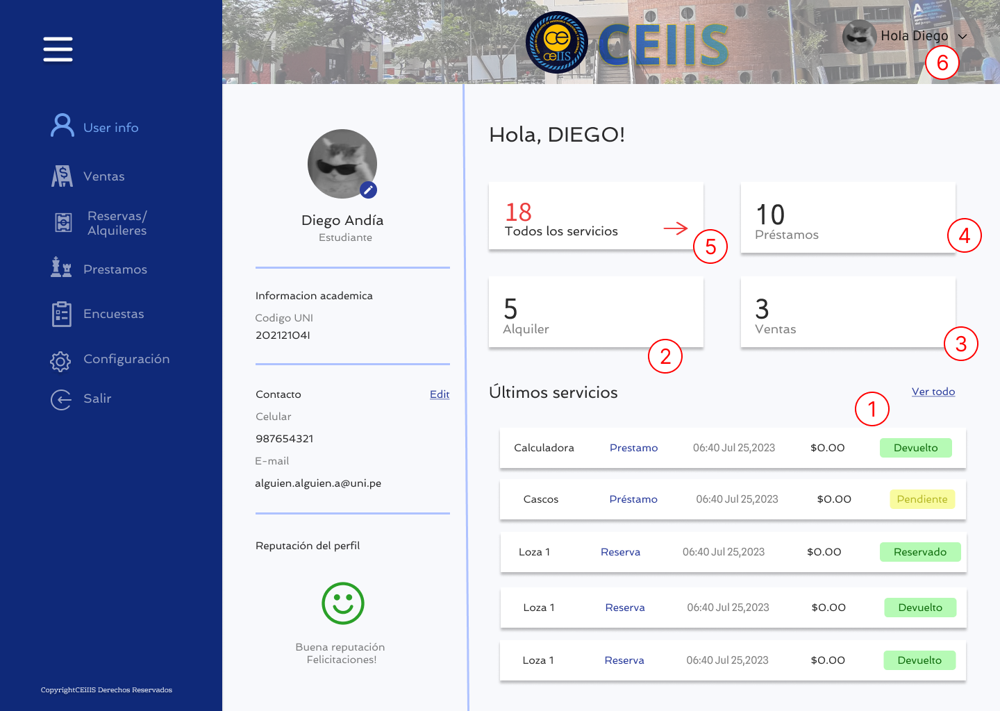
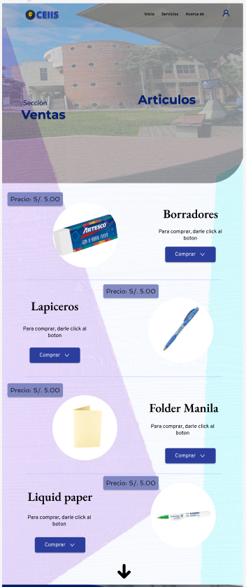
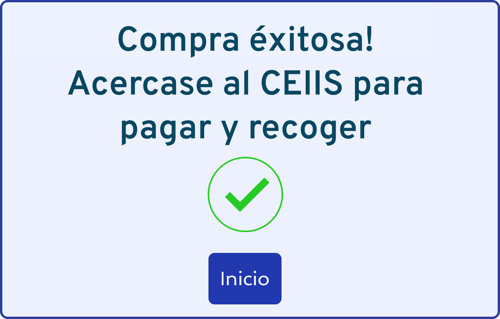

Se eligió el flujo desde el inicio de sesión de un usuario hasta la compra de un artículo (flujo principal)

Una vez iniciado sesión nos redirige al menú de perfil del usuario

Damos clic a la sección de ventas y nos redirige a la interfaz de ventas. Elegimos el producto que deseamos y le damos a comprar.

Nos aparecerá una interfaz para confirmar la compra. Le damos clic a confirmar.

Una vez confirmada la compra nos aparecerá un mensaje del éxito de la compra.

