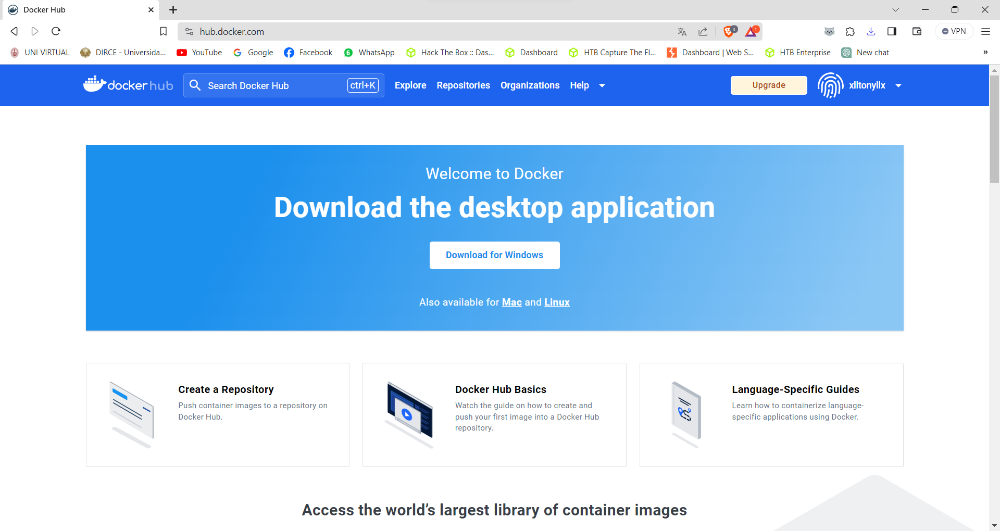
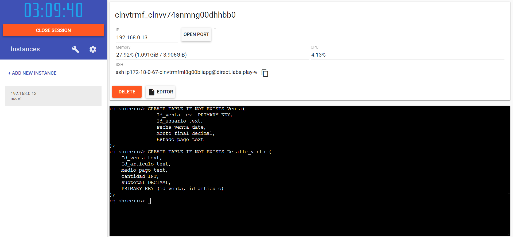
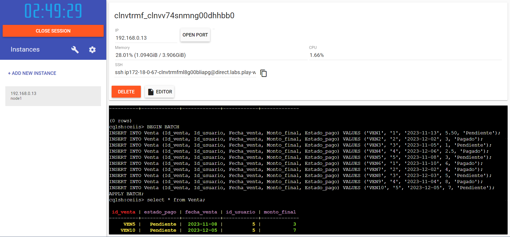
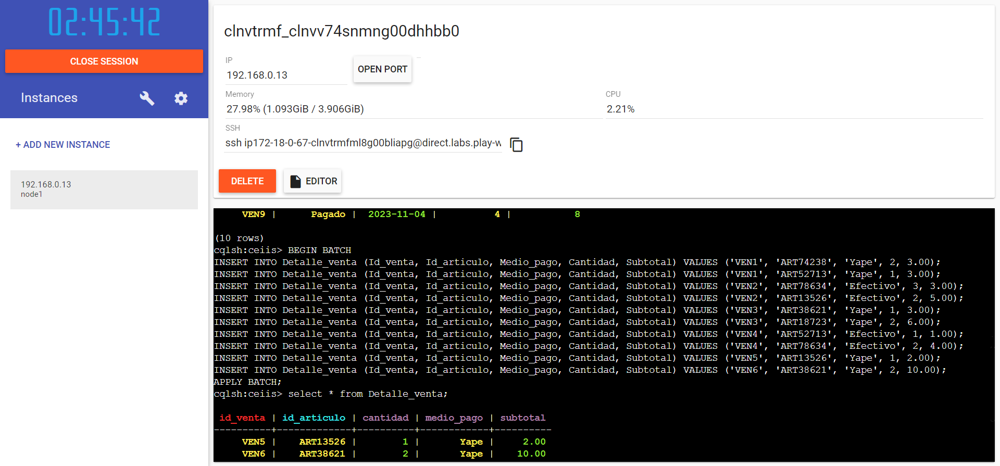
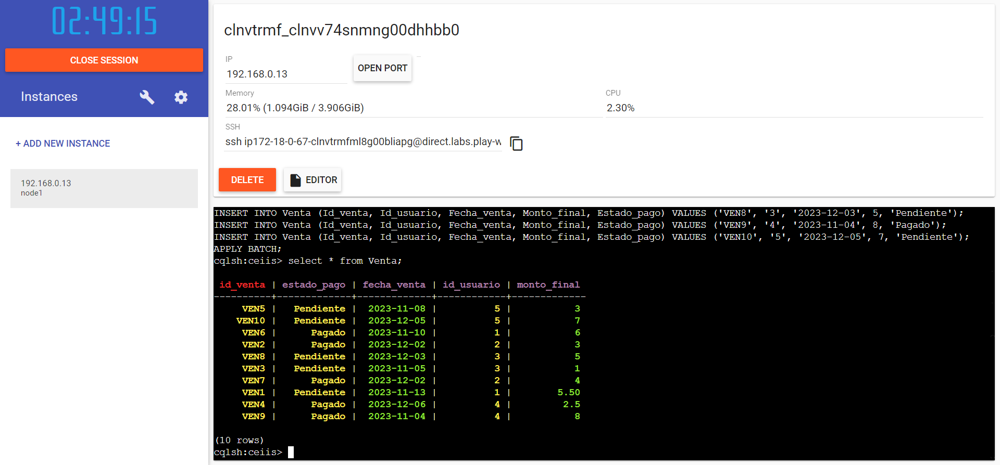
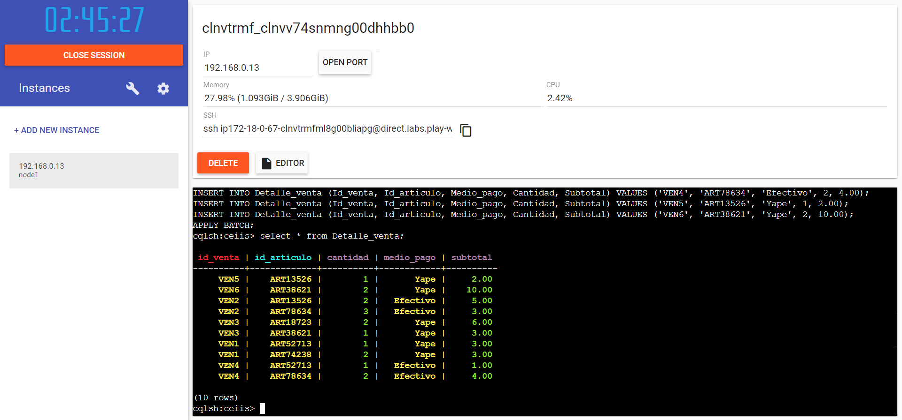

# GESTOR DE BASE DE DATOS NoSQL SCYLLADB
##  1. Aplicación de una base de datos NoSQL
### 1.1 Desarrollo Conceptual
- **Tipo de motor de busqueda: Columnar**

El concepto de Bases de Datos Columnares nace en la década de 1970 a través de productos como Model 204 y ABABAS. A partir de 2004, estas bases de datos han experimentado una evolución constante para su implementación en entornos comerciales. En la actualidad, su progreso y aplicación han generado una notable competencia y una amplia variedad de opciones en el ámbito de las bases de datos columnares.[1]

El uso de almacenamiento basado en columnas en las tablas de bases de datos juega un papel crucial en la mejora del rendimiento de consultas analíticas, ya que significativamente reduce los requerimientos generales de E/S del disco y minimiza la cantidad de datos que deben cargarse desde él. Al igual que otras bases de datos NoSQL, las bases de datos columnares están diseñadas para optimizar la escalabilidad mediante el empleo de clústeres distribuidos de hardware asequible, lo que resulta especialmente beneficioso para el almacenamiento y procesamiento eficiente de grandes volúmenes de datos, como en el caso del Big Data. [2]
 - Ventajas:
   - Proporcionan una gran velocidad, trabajan de forma que omiten datos irrelevantes para el analisis y encontrar lo que se busca de forma inmediata.
   - Almacenan datos en registros de forma que puedan contener una gran cantidad de columna dinamicas.
   - Reduce los requisitos globales de E/S del disco y tambien disminuyen el columen de datos que requiere cargar desde él.
   - El diseño de las bases de datos columnares están pensada para aumentar el desempeño.
- **Motor de busqueda: ScyllaDB**

  Scylla es un software gestor de base de datos NoSQL distribuida y software libre que se diseñó para ser compatible con Apache Cassandra y se destaca por la capacidad de cada nodo para manejar millones de operaciones por segundo, todo ello con una baja latencia de manera predecible. Emplea un modelo de programación totalmente asíncrono y que no comparte nada, se basa en sus propios asignadores de memoria y programa meticulosamente todas sus solicitudes de Entrada/Salida.

- Ventajas:
  - Logra una gran velocidad debido a que emplea un modelo de programación totalmente asíncrono y que no comporte nada.
  - Sebasa en sus propios asigandores de memoria y programa meticulosamente todas las solicitudes de entrada y salida.
  - Tiene de a 8 veces mejor rendimiento que la versión 4.0 de casandra
  - Los costos son ineriores porque ahorra tiempo en la administración.
  - La capacidad de migración hace que sea compatible con Apache Cassandra.
  - Tiene una aquitectura diseñada para eliminar los problemas de rendimiento, las limitaciones y las barreras operativas de Cassandra.

ScyllaDB no se apoya en la caché de páginas, destinando la mayoría de su memoria a la caché de filas. La Row-Cache (caché de filas) almacena los datos en un formato de memoria optimizado que ocupa menos espacio y no requiere de los procesos de serialización o deserialización. Esto proporciona un alto nivel de seguridad, dado que la serialización implica la traducción de las estructuras de datos a un formato que puede ser almacenado y posteriormente reconstruido.[3]

### 1.2 Descripción de escenario de uso

**Escenario: Finanzas**

En el desarrollo de la pagina web para el CEIIS se identificó al módulo de finanzas como un escenario que puede beneficiarse significativamente de una base de datos columnar en comparación con uno realcional. A continuación, se exploran las tareas que se realizan en este módulo y las ventajas especificas en la eficiencia de tareas financieras clave utilizan un motor de tipo columnar (ScyllaDB) en contraste con un motor relacional (PostgresSQL):
 - Tarea 1: Total de transacciones al Mes
   
   En esta tarea se tiene que gestionar el total de transacciones realizadas mediante la pagina web del CEIIS en un mes, el enfoque columnar muentra ventajas dado que las bases de datos columanres almacenan datos en columnas en lugar de filas, realizr agregaciones como el conteo de transacciones se vuelve más eficiente. ScyllaDB puede escalar horizontalmente para manejar grandes volúmenes de datos, lo que facilita el procesamiento rápido y eficiente de las transacciones mensuales.
 - Tarea 2: Total recaudado al mes por venta y alquiler (separado y junto)
   
   Gestion las ventas y alquiles, tanto separado como en conjunto, se beneficia de la estructura columnar. Los datos se almacenan en columnas, las consultas analíticas para calcular el total recaudado se realizan de manera más eficiente, ay que solo se accede a las columnas relevantes. Además, ScyllaDB tiene la capacidad para manejar grandes cantidades de datos y consultas paralelas garantizando un rendimiento óptimo, incluso en situaciones donde se deben analizar grandes conjuntos de información.

 **Ventajas de un motor columnar sobre un motor realacional**
1. Rendimiento en consultas analíticas:
   - La estructura columnar supera a los motores relacionales al realizar consultas analíticas complejas de manera eficeinte. Esto es crucial para calcular totales y estadisticas financieras.
    
2. Escalabilidad Horizontal:
   - En comparación con lo moteres relaciones, se destaca en las bases de datos columnares la escalabilidad horizontal, permitiendo manejar grandes volúmenes de datos de manera efectiva y sostenible a medida que crecerá la actividad financiera de la pagina web del CEIIS.
     
3. Baja latencia:
   - La baja latencia predecible de ScyllaDB garantiza respuestas rápidas en la obtención de datos financieros, contribuyendo a una experiencia de usuario más ági y eficiente.

### 1.3 Configuración
Para hacer uso de ScyllaDB nos apoyaremos de Play with Docker.
1. Primero ingresaremos a Play with Docker y agregaremos una nueva instancia.

2. En Docker hub buscaremos ScyllaDB y descargaremos la imagen con el comando:

   

       docker pull scylladb/scylla

4. Después iniciaremos un clúster de un solo nodo de Scylla en modo desarrollador con el siguiente comando:

       docker run --name some-scylla --hostname some-scylla -d scylladb/scylla --smp 1

5. Luego ejecutamos un nodetool con el siguiente comando:

       docker exec -it some-scylla nodetool status

6. Seguido ejecutamos un cqlsh con este comando:

       docker exec -it some-scylla cqlsh

7. A continuación, cree un espacio de claves llamado ceiis:

       CREATE KEYSPACE ceiis WITH replication = {'class': 'NetworkTopologyStrategy', 'replication_factor' : 3} AND durable_writes = true;

8. Utilice el espacio de claves recién definido con:

       USE ceiis;

Con esto ya se pueden crear las tablas, hacer los inserts y hacer consultas.

### 1.4 Implementación

#. Vamos a crear las tablas de venta y detalle_venta:

   
   
#. Una vez creadas la tablas procedemos a realizar los inserts:

 - Para la tabla Venta:
  
   
   
 - Para la tabla Detalle_venta:
  
   
   
#. Comprobamos que los datos insertados estén correctos:

   

   

  **Referencias**

[1]https://gravitar.biz/bi/base-datos-columnar/

[2]https://aws.amazon.com/es/nosql/columnar/

[3] https://eiposgrados.com/blog-python/scylladb/#:~:text=Ventajas%20de%20ScyllaDB&text=Tiene%20mejor%20rendimiento%20(de%202,Apache%20Cassandra%20con%20grandes%20ventajas.
