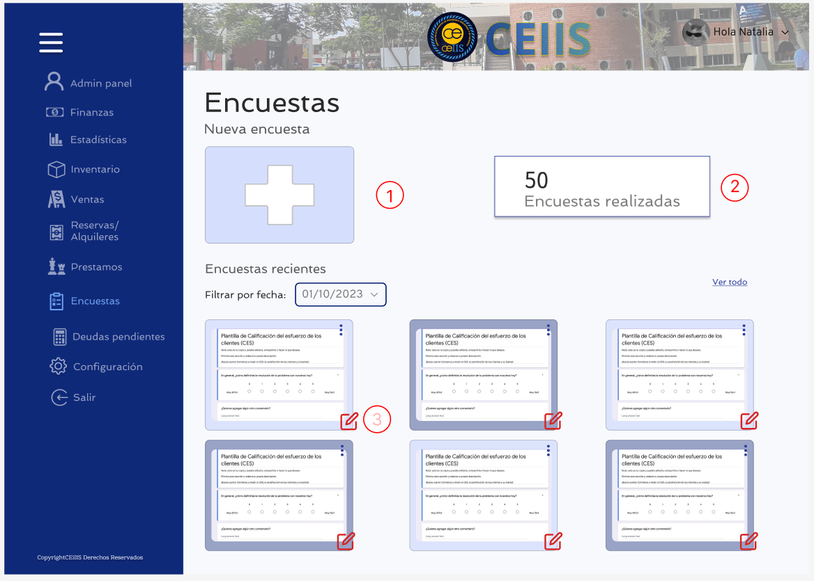
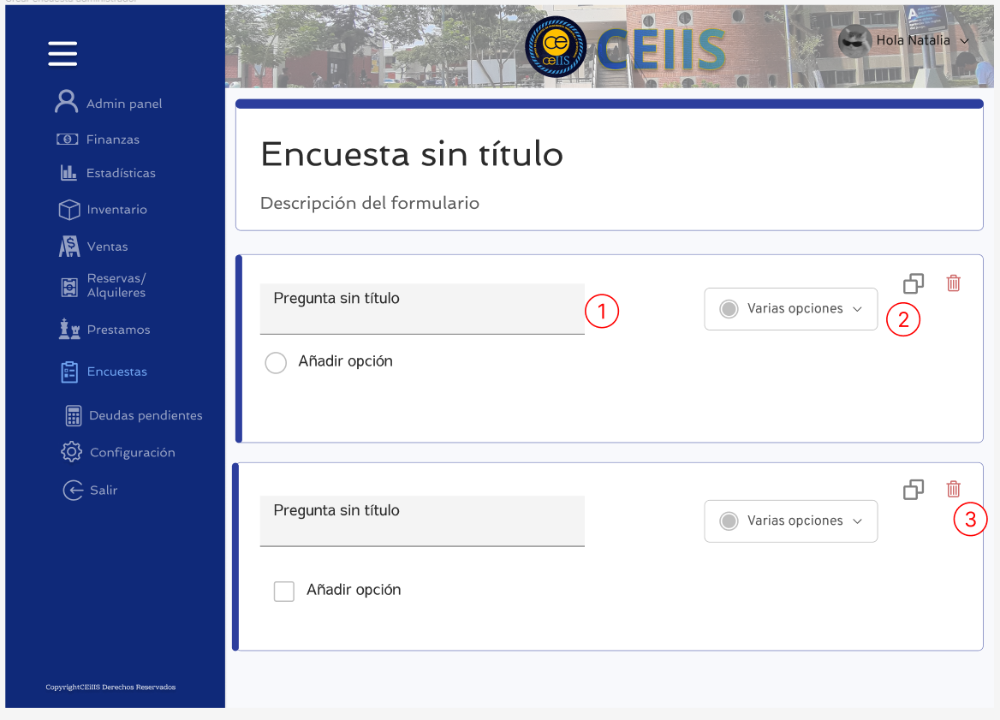
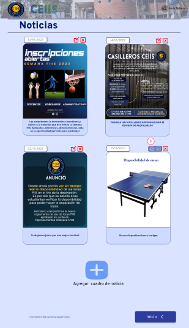
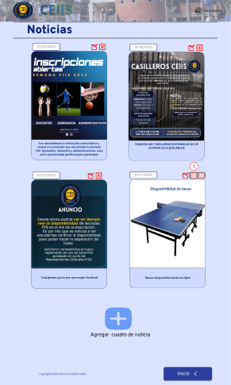

# CREACION DE TABLAS

# Sentencias SQL por cada prototipo
## 1
| Código requerimiento | R-001 |
| --- | --- |
| Codigo interfaz |  I-001 |
| Imagen interfaz  |

| Sentencias SQL |
| --- |
| Eventos |
| **1. Botón Registrar:** Se agregará un nuevo registro a la tabla persona y tabla usuario |
|**INSERT INTO Persona (Dni,primer_nombre, primer_apellido, segundo_apellido, Celular) VALUES (<2>, <3>, <4>, <5>);**|
|**INSERT INTO Usuario (Correo_uni, cod_uni, Contrasena, Dni) VALUES (<1>, <6>, <7> , (SELECT Dni FROM persona WHERE Dni = <2>);**|

## 2
| Código requerimiento | R-002 |
| --- | --- |
| Codigo interfaz |  I-002 |
| Imagen interfaz  |

| Sentencias SQL |
| --- |
| Eventos |
| **1. Botón Iniciar Sesión:** El usuario ingresa a su cuenta |
|**SELECT Id_usuario, Cod_uni FROM Usuario WHERE Correo_uni = <1> AND Contrasena = <2>;**|

## 3
| Código requerimiento | R-003 |
| --- | --- |
| Codigo interfaz |  I-003 |
| Imagen interfaz  |

| Sentencias SQL |
| --- |
| Eventos |
| **1. Botón Restaurar contraseña:**  |
|**SELECT Id_usuario, Correo_uni FROM Usuario WHERE Correo_uni = <1>;**|

## 4
| Código requerimiento | R-004 |
| --- | --- |
| Codigo interfaz |  I-004 |
| Imagen interfaz  |

| Sentencias SQL |
| --- |
| Eventos |
| **1. Botón Restablecer tu contraseña:** Se realiza una actualizacion en la columna "Contrasena" de la tabla usuario. |
	UPDATE Usuario
	SET Contraseña = <1>
	WHERE id_usuario = 'identificador_del_usuario';

## 5
| Código requerimiento | R-005 |
| --- | --- |
| Codigo interfaz |  I-005 |
| Imagen interfaz  |

| Sentencias SQL |
| --- |
| Eventos |
| **1. Cargar pagina:** Se muestra un reporte de las tablas alquiler, ventas y prestamos en el perfil personal del usuario. Se muestra un conteo de los servicios realizados por el usuario y un conteo total de los servicio utilizados. Se extrae información de la tabla usuario y persona para que aparezca en el perfil de usuario. |

	SELECT  
	    Ar.Nombre_articulo AS Nombre_producto,
	    Ar.Tipo_articulo AS Tipo_servicio,
	    A.Fecha_alquiler AS Fecha_operacion,
	    A.Hora_inicio,
	    A.Hora_fin,
		NULL AS Fecha_devolucion,
		A.Monto,
	    A.Estado_alquiler AS Estado_operacion
	FROM
	    Alquiler A
	INNER JOIN
		 Usuario U ON A.Id_usuario = U.Id_usuario
	INNER JOIN
	    Articulo Ar ON A.Id_articulo = Ar.Id_articulo
	WHERE
	    U.Id_usuario = '1'
	
	UNION
	
	SELECT
	    Ar.Nombre_articulo AS Nombre_producto,
	    Ar.Tipo_articulo AS Tipo_servicio,
	    P.Fecha_prestamo AS Fecha_operacion,
	    P.Hora_prestamo AS Hora_inicio, 
		P.Hora_devolucion  As Hora_fin,
	    P.Fecha_devolucion, 
		NULL AS Monto,
	    P.Estado_prestamo AS Estado_operacion
	FROM
	    Prestamo P
	INNER JOIN
	    Usuario U ON P.Id_usuario = U.Id_usuario
	INNER JOIN
	    Articulo Ar ON P.Id_articulo = Ar.Id_articulo
	WHERE
	    U.Id_usuario = '1'
		
	UNION
	
	SELECT
	    A.Nombre_articulo AS Nombre_producto,
	    A.Tipo_articulo AS Tipo_servicio,
	    V.Fecha_venta AS Fecha_operacion,
		NULL AS Hora_inicio,
		NULL AS Hora_fin,
		NULL AS Fecha_devolucion,
	    A.Precio_unitario AS Monto,
	    V.Estado_pago AS Estado_operacion
	FROM
	    Detalle_venta DV
	INNER JOIN
	    Venta V ON DV.Id_venta = V.Id_venta
	INNER JOIN
	    Articulo A ON DV.Id_articulo = A.Id_articulo
	INNER JOIN
	    Usuario U ON V.Id_usuario = U.Id_usuario
	WHERE
	    U.Id_usuario = '1';

|**CONTAR CANTIDAD DE PRESTAMOS DEL USUARIO**|

	SELECT
	    COUNT(P.Id_prestamo) AS Cantidad_prestamos
	FROM
	    Prestamo P
	INNER JOIN
	    Usuario U ON P.Id_usuario = U.Id_usuario
	WHERE
	    U.Id_usuario = '1';
	
|**CONTAR CANTIDAD DE VENTAS DEL USUARIO**|

	SELECT
	    COUNT(V.Id_venta) AS Cantidad_ventas
	FROM
	    Venta V
	INNER JOIN
	    Usuario U ON V.Id_usuario = U.Id_usuario
	WHERE
	    U.Id_usuario = '1';
	
|**CONTAR CANTIDAD DE ALQUILER DEL USUARIO**|

	SELECT
	    COUNT(A.Id_alquiler) AS Cantidad_ventas
	FROM
	    Alquiler A
	INNER JOIN
	    Usuario U ON A.Id_usuario = U.Id_usuario
	WHERE
	    U.Id_usuario = '1';	

|**TOTAL DE SERVICIOS UTILIZADOS POR EL USUARIO**|

	SELECT
	    U.Id_usuario,
	    U.DNI,
	    (
	        -- Subconsulta para contar registros de préstamos
	        COALESCE((SELECT COUNT(*) FROM Prestamo P WHERE P.Id_usuario = U.Id_usuario), 0) +
	        -- Subconsulta para contar registros de ventas
	        COALESCE((SELECT COUNT(*) FROM Venta V WHERE V.Id_usuario = U.Id_usuario), 0) +
	        -- Subconsulta para contar registros de alquileres
	        COALESCE((SELECT COUNT(*) FROM Alquiler A WHERE A.Id_usuario = U.Id_usuario), 0)
	    ) AS Total_registros
	FROM
	    Usuario U
	WHERE
	    U.Id_usuario = '1';	 

## 6
| Código requerimiento | R-00 |
| --- | --- |
| Codigo interfaz |  I-00 |
| Imagen interfaz  |

| Sentencias SQL |
| --- |
| Eventos |
| **1. Cargar pagina:** Se muestra un reporte de las tablas alquiler, ventas y prestamos en el perfil personal del usuario, y se realiza una busqueda por fecha. |

	SELECT  
	
	    Ar.Nombre_articulo AS Nombre_producto,
	    Ar.Tipo_articulo AS Tipo_servicio,
	    A.Fecha_alquiler AS Fecha_operacion,
	    A.Hora_inicio,
	    A.Hora_fin,
		NULL AS Fecha_devolucion,
		A.Monto,
	    A.Estado_alquiler AS Estado_operacion
	FROM
	    Alquiler A
	INNER JOIN
		 Usuario U ON A.Id_usuario = U.Id_usuario
	INNER JOIN
	    Articulo Ar ON A.Id_articulo = Ar.Id_articulo
	WHERE
	    U.Id_usuario = '1'
		 AND A.Fecha_alquiler = '2023-11-13'
		
	UNION
	
	SELECT
	    Ar.Nombre_articulo AS Nombre_producto,
	    Ar.Tipo_articulo AS Tipo_servicio,
	    P.Fecha_prestamo AS Fecha_operacion,
	    P.Hora_prestamo AS Hora_inicio, 
		P.Hora_devolucion  As Hora_fin,
	    P.Fecha_devolucion, 
		NULL AS Monto,
	    P.Estado_prestamo AS Estado_operacion
	FROM
	    Prestamo P
	INNER JOIN
	    Usuario U ON P.Id_usuario = U.Id_usuario
	INNER JOIN
	    Articulo Ar ON P.Id_articulo = Ar.Id_articulo
	WHERE
	    U.Id_usuario = '1'
		 AND P.Fecha_prestamo = '2023-11-13'
		
	UNION
	
	SELECT
	    A.Nombre_articulo AS Nombre_producto,
	    A.Tipo_articulo AS Tipo_servicio,
	    V.Fecha_venta AS Fecha_operacion,
		NULL AS Hora_inicio,
		NULL AS Hora_fin,
		NULL AS Fecha_devolucion,
	    A.Precio_unitario AS Monto,
	    V.Estado_pago AS Estado_operacion
	FROM
	    Detalle_venta DV
	INNER JOIN
	    Venta V ON DV.Id_venta = V.Id_venta
	INNER JOIN
	    Articulo A ON DV.Id_articulo = A.Id_articulo
	INNER JOIN
	    Usuario U ON V.Id_usuario = U.Id_usuario
	WHERE
	    U.Id_usuario = '1'
		AND V.Fecha_venta = '2023-11-13';

## 7
| Código requerimiento | R-005 |
| --- | --- |
| Codigo interfaz |  I-005 |
| Imagen interfaz  |

 

| Sentencias SQL |
| --- |
| Eventos |
| **1. Cambiar la contraseña:** Se realiza una actualización de la columna "Contraseña" de la tabla "Usuario". |

	UPDATE Usuario
	SET Contraseña = <1>
	WHERE IdUsuario = 'id_del_usuario' AND Contraseña = <2>;

## 8
| Código requerimiento | R-005 |
| --- | --- |
| Codigo interfaz |  I-005 |
| Imagen interfaz  |

 

| Sentencias SQL |
| --- |
| Eventos |
| **1. Cargar Pagina:** Se muestra un reporte de las tablas alquiler, ventas y prestamos generales en el perfil del administrador. Se muestra un conteo de cada 
tipo de servicios realizado por el Ceiis y un conteo total de los servicio prestados por mes. Se extrae información de la tabla usuario y persona para que aparezca en el perfil de usuario. |

	SELECT  
	    Ar.Nombre_articulo AS Nombre_producto,
	    Ar.Tipo_articulo AS Tipo_servicio,
	    A.Fecha_alquiler AS Fecha_operacion,
	    A.Hora_inicio,
	    A.Hora_fin,
		NULL AS Fecha_devolucion,
		A.Monto,
	    A.Estado_alquiler AS Estado_operacion,
		A.Medio_pago
	FROM
	    Alquiler A
	INNER JOIN
	    Articulo Ar ON A.Id_articulo = Ar.Id_articulo
	
	UNION

	SELECT
	    Ar.Nombre_articulo AS Nombre_producto,
	    Ar.Tipo_articulo AS Tipo_servicio,
	    P.Fecha_prestamo AS Fecha_operacion,
	    P.Hora_prestamo AS Hora_inicio, 
		P.Hora_devolucion  As Hora_fin,
	    P.Fecha_devolucion, 
		NULL AS Monto,
	    P.Estado_prestamo AS Estado_operacion,
		NULL AS Medio_pago
	FROM
	    Prestamo P
	INNER JOIN
	    Articulo Ar ON P.Id_articulo = Ar.Id_articulo
		
	UNION
	
	SELECT
	    A.Nombre_articulo AS Nombre_producto,
	    A.Tipo_articulo AS Tipo_servicio,
	    V.Fecha_venta AS Fecha_operacion,
		NULL AS Hora_inicio,
		NULL AS Hora_fin,
		NULL AS Fecha_devolucion,
	    A.Precio_unitario AS Monto,
	    V.Estado_pago AS Estado_operacion,
		DV.Medio_pago
	FROM
	    Detalle_venta DV
	INNER JOIN
	    Venta V ON DV.Id_venta = V.Id_venta
	INNER JOIN
	    Articulo A ON DV.Id_articulo = A.Id_articulo;
		
 |**Contar la cantidad de Ventas**|
 
	SELECT
	    COUNT(V.Id_venta) AS Cantidad_ventas
	FROM
	    Venta V;
		
		
|**Contar la cantidad de prestamos**|

	SELECT
	    COUNT(P.Id_prestamo) AS Cantidad_prestamos
	FROM
	    Prestamo P;
		
|**contar la cantidad de Alquiler**|

	SELECT
	    COUNT(A.Id_alquiler) AS Cantidad_ventas
	FROM
	    Alquiler A;
**Suma de registros totales DE LA PAGINA DEL CEIIS**

	SELECT
	    (
	        -- Subconsulta para contar registros de préstamos
	        COALESCE((SELECT COUNT(*) FROM Prestamo P ), 0) +
	        -- Subconsulta para contar registros de ventas
	        COALESCE((SELECT COUNT(*) FROM Venta V ), 0) +
	        -- Subconsulta para contar registros de alquileres
	        COALESCE((SELECT COUNT(*) FROM Alquiler A ), 0)
	    ) AS Total_registros ;	

## 9
| Código requerimiento | R-00 |
| --- | --- |
| Codigo interfaz |  I-00 |
| Imagen interfaz  |

| Sentencias SQL |
| --- |
| Eventos |
| **1. Cargar pagina:** Se llenará la fecha de las encuestas a mostrar  |
| **SELECT Id_encuesta FROM Encuesta E WHERE E.Fecha_apertura = '<1>'**;|
| **2. Cargar pagina:** Muestra las encuestas activas  |
|**SELECT Id_encuesta FROM Encuesta E WHERE E.Estado_encuesta = 'activo'; <2>**|

## 10
| Código requerimiento | R-00 |
| --- | --- |
| Codigo interfaz |  I-00 |
| Imagen interfaz  |

| Sentencias SQL |
| --- |
| Eventos |
| **1. Botón cruz:** Se añadirá una nueva encuesta|
| **INSERT INTO Encuesta (Id_encuesta, Id_administrador, Fecha_apertura, Fecha_cierre, Cantidad_preguntas, Cantidad_respuestas, Estado_encuesta) VALUES ('ENC0011', 'ADM005', '2024-01-13', '2024-01-20', 9, 30, 'inactivo');'<1>'**|
| **2. Cargar pagina:** Muestra las encuestas realizadas**  |
|**SELECT COUNT(E.Id_encuesta) AS "Encuestas Realizadas" FROM Encuesta E; <2>**|
| **3. Botón editar encuesta: Se edita una encuesta activa** |
|**UPDATE Encuesta SET Fecha_apertura = '2023-12-13', Fecha_cierre = '2023-12-23', Cantidad_preguntas = '9', Cantidad_respuestas = '9', Estado_encuesta = 'inactivo' WHERE Id_encuesta = 'ENC002'; <3>** |

## 11
| Código requerimiento | R-00 |
| --- | --- |
| Codigo interfaz |  I-00 |
| Imagen interfaz  |

| Sentencias SQL |
| --- |
| Eventos |
|**1. Cargar pagina:** Se llenará la pregunta asociada a una encuesta  |
|**INSERT INTO Pregunta (Id_pregunta, Id_encuesta, Id_administrador, Descripción, Tipo_respuesta) VALUES ('PRE0011', 'ENC004', 'ADM004','¿En qué ciclo relativo se encuentra?', 'opcion multiple'); <1>**| 
|**2. Cargar pagina:** Se escogerá el tipo de pregunta |
|**UPDATE Pregunta SET Tipo_respuesta = 'opcion multiple' WHERE Id_encuesta = 'ENC004' AND Id_pregunta = 'PRE006';<2>  **|
|**2. Botón papelera:** Se borrará la pregunta|
|**DELETE FROM Pregunta WHERE Id_encuesta = 'id_de_tu_encuesta' AND Id_pregunta = 'id_de_tu_pregunta';<3>  **|

## 12
| Código requerimiento | R-00 |
| --- | --- |
| Codigo interfaz |  I-00 |
| Imagen interfaz  |

| Sentencias SQL |
| --- |
| Eventos |
| **1. Cargar página:** Se mostraran los reservas y alquileres   |
|**SELECT Nombre_articulo, Precio_unitario FROM Articulo WHERE Tipo_articulo = 'reservas y alquileres';** |

## 13
| Código requerimiento | R-00 |
| --- | --- |
| Codigo interfaz |  I-00 |
| Imagen interfaz  |

| Sentencias SQL |
| --- |
| Eventos |
| **1. Cargar página:** Se mostraran los productos para venta  |
|**SELECT Nombre_articulo, Precio_unitario FROM Articulo WHERE Tipo_articulo = 'reservas y alquileres';** |

## 14
| Código requerimiento | R-00 |
| --- | --- |
| Codigo interfaz |  I-00 |
| Imagen interfaz  |

| Sentencias SQL |
| --- |
| Eventos |
| **1. Cargar página:** Se mostraran los productos para prestamo   |
|**SELECT Nombre_articulo FROM Articulo WHERE Tipo_articulo = 'prestamo';**|

## 15
| Código requerimiento | R-019-021 |
| --- | --- |
| Codigo interfaz |  I-001 |
| Imagen interfaz  |

| Sentencias SQL |
| --- |
| Eventos |
| **1. Cargar página:** Se mostrarán los artículos y las cantidades que se han vendido en dicho día |
|**SELECT SUM(dv.cantidad) FROM detalle_venta dv INNER JOIN venta v ON dv.id_venta = v.id_venta AND dv.id_articulo = <ID_ARTICULO> AND v.fecha_venta = <FECHA>;**|
| **2. Cargar página:** Se mostrarán todos los artículos, su precio unitario y el stock restante para la venta |
|**SELECT Id_articulo, nombre_articulo, precio_unitario, cantidad FROM Articulo WHERE tipo_articulo = 'venta';**|

## 16
| Código requerimiento | R-021 |
| --- | --- |
| Codigo interfaz |  I-001 |
| Imagen interfaz  |

| Sentencias SQL |
| --- |
| Eventos |
| **1. Botón Check:** Se modifica el precio y/o stock de un artículo |
|**UPDATE Articulo SET cantidad = <CANTIDAD> , precio_unitario = <PRECIO> WHERE Id_articulo = <ID_ARTICULO>;**|

## 17
| Código requerimiento | R-020 |
| --- | --- |
| Codigo interfaz |  I-001 |
| Imagen interfaz  |

| Sentencias SQL |
| --- |
| Eventos |
| **1. Botón Check:** Se agrega un nuevo artículo al inventario de ventas |
|**INSERT INTO Articulo(Id_articulo, Nombre_articulo, Tipo_articulo, Cantidad, Descripcion, Precio_unitario, Disponibilidad) VALUES (<1>, <2>, <3>, <4>, <5>, <6>, <7>);**|

## 18
| Código requerimiento | R-019 |
| --- | --- |
| Codigo interfaz |  I-001 |
| Imagen interfaz  |

| Sentencias SQL |
| --- |
| Eventos |
| **1. Botón de papelera:** Se elimina dicho artículo del inventario de ventas |
|**DELETE FROM Articulo WHERE Id_articulo = <ID_ARTICULO>;**|

## 19
| Código requerimiento | R-022-024 |
| --- | --- |
| Codigo interfaz |  I-001 |
| Imagen interfaz  |

| Sentencias SQL |
| --- |
| Eventos |
| **1. Cargar página:** Se mostrarán los artículos y las cantidades que se han prestado en dicho día |
|**SELECT COUNT(*) FROM Prestamo WHERE Estado_prestamo = 'No devuelto' AND Fecha_prestamo = <FECHA_PRESTAMO>;**|
| **2. Cargar página:** Se mostrarán todos los artículos y el stock restante para el préstamo |
|**SELECT Id_articulo, nombre_articulo, cantidad FROM Articulo WHERE tipo_articulo = 'prestamo';**|

## 20
| Código requerimiento | R-024 |
| --- | --- |
| Codigo interfaz |  I-001 |
| Imagen interfaz  |

| Sentencias SQL |
| --- |
| Eventos |
| **1. Botón Check:** Se modificará la cantidad en stock de un artículo en el inventario de préstamos |
|**UPDATE Articulo SET cantidad = <CANTIDAD> WHERE Id_articulo = <ID_ARTICULO>;**|

## 21
| Código requerimiento | R-023 |
| --- | --- |
| Codigo interfaz |  I-001 |
| Imagen interfaz  |

| Sentencias SQL |
| --- |
| Eventos |
| **1. Botón Check:** Se modificará la cantidad en stock de un artículo en el inventario de préstamos |
|**INSERT INTO Articulo(Id_articulo, Nombre_articulo, Tipo_articulo, Cantidad, Descripcion, Precio_unitario, Disponibilidad) VALUES (<1>, <2>, <3>, <4>, <5>, null, <7>);**|

## 22
| Código requerimiento | R-022 |
| --- | --- |
| Codigo interfaz |  I-001 |
| Imagen interfaz  |

| Sentencias SQL |
| --- |
| Eventos |
| **1. Botón de papelera:** Se elimina dicho artículo del inventario de préstamos |
|**DELETE FROM Articulo WHERE Id_articulo = <ID_ARTICULO>;**|

## 23
| Código requerimiento | R-018 |
| --- | --- |
| Codigo interfaz |  I-001 |
| Imagen interfaz  |

| Sentencias SQL |
| --- |
| Eventos |
| **1. Cargar página:** Se mostrarán los horarios de las losas durante la semana |
|**SELECT * FROM Calendario ORDER BY <FECHA>, <ID_HORA>;**|

## 24
| Código requerimiento | R-018 |
| --- | --- |
| Codigo interfaz |  I-002 |
| Imagen interfaz  |

| Sentencias SQL |
| --- |
| Eventos |
| **1. Botón Aceptar:** Cambiar la disponibilidad de cierto día y hora del horario de la semana (Pueden ser varios cambios en diferentes días en simultáneo)  |
|**UPDATE calendario SET estado = CASE WHEN estado = 'Ocupado' THEN 'Disponible' WHEN estado = 'Disponible' THEN 'Ocupado' END WHERE id_hora = <ID_HORA> AND Fecha = <FECHA>;**|

## 25
| Código requerimiento | R-006 |
| --- | --- |
| Codigo interfaz |  I-00 |
| Imagen interfaz  |

| Sentencias SQL |
| --- |
| Eventos |
| **1. Botón Noticia:** Se mostrará el contenido de la noticia |
|**SELECT Fecha, Titulo, Descricion FROM Noticia;**|

## 26
| Código requerimiento | R-025 |
| --- | --- |
| Codigo interfaz |  I-00 |
| Imagen interfaz  |

| Sentencias SQL |
| --- |
| Eventos |
| **1. Botón Confirmar:** Se agregarán la fecha, titulo y la descripcion de la noticia |
|**INSERT INTO Noticia (Id_notica, Id_administrador, Fecha, Titulo, Descripcion) VALUES (<Id_noticia>, <Id_administrador>, < fecha >, < titulo >, < desccripcion >);**|

## 27
| Código requerimiento | R-025 |
| --- | --- |
| Codigo interfaz |  I-00 |
| Imagen interfaz  |

| Sentencias SQL |
| --- |
| Eventos |
| **1. Botón Confirmar:** Se cambiaran lo que desee de la noticia, ya sea fecha, titulo, descripcion  |
|**UPDATE Noticia SET Fecha = < fecha > , < titulo > , <Descripción> WHERE Id_noticia = <Id_noticia>;**|

## 28
| Código requerimiento | R-025 |
| --- | --- |
| Codigo interfaz |  I-00 |
| Imagen interfaz  |

| Sentencias SQL |
| --- |
| Eventos |
| **1. Botón Confirmar:** Se eliminara la noticia que ya pasó el evento o la informacion colocada  |
|**DELETE FROM Noticia WHERE Id_notica = <ID_NOTICIA>**|

# Funcionalidad Primaria Elegida (por módulo)

### 1.Modulo de seguridad
**Flujo de actividades**
1. El usuario ingresa a su cuenta personal proporcionando su correo y su contraseña y se dirige a perfil.
   

2. Una vez en su perfil el usuario visualiza un reporte de los últimos servicios que ha utilizado del CEIIS, y conteos de estos. Se muestra un conteo de cada tipo de servicio por separado y un conteo general de los servicios utilizados.

3. El usuario tiene la opción de presionar “Ver todo” para dirigirse y tener un reporte completo de todos los servicios que ha utilizado, este reporte puede filtrase por fecha.

**Justificacion**
Esta actividad es elegida la funcionalidad principal porque permite que el usuario puede visualizar un historial de los servicios que ha utilizado, además de poder ver el estado (pendiente, devuelto) de los servicios de alquiler que ha realizado. 
Esto proporciona al usuario una visión clara y detallada de los servicios que han utilizado, evaluar su propia actividad y detectar algún uso no reconocido de los servicios. 
El filtro de fecha ofrece a los usuarios la posibilidad de acceder fácilmente a informes detallados sobre su actividad contribuye a una experiencia de usuario mejorada. Los usuarios se benefician al tener un control más claro sobre su propia información y actividad.
Los requerimientos e interfaces elegidos fueron:
| Requerimiento | Interfaz |
| --- | --- |
| R-002 |  I-002 |
| R-005 |  I-005 |
| R-005 |  I-006 |
