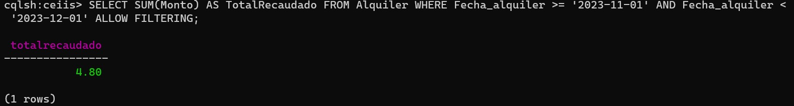

# DBD-Grupo-3
# "Implementación de un software ..."

## 1. Descripción de la Empresa, del Proceso de Negocio Elegido y Motivación
### 1.1 Descripción de la empresa
**1.1.1 Datos generales:**

    -Nombre de la empresa: Centro de Estudiantes de Ingeniería Industrial y de Sistemas (CEIIS).
    -Tipo empresa: Organización sin fines de lucro.
    -Función: El CEIIS es el máximo órgano representativo de todos los estudiantes de la Facultad de Ingeniería Industrial, Sistemas y Software.

Pagina de facebook: [Facebook CEIIS](https://www.facebook.com/ceiis.oficial)
### 1.2 Procesos internos de la empresa
    1.2.1 Proceso de alquiler
    __1.2.1.1 Proceso de prestamos__
    __1.2.1.2 Recepción de la solicitud de préstamos__
    __1.2.1.3 Evaluación de la solicitud__
    __1.2.1.4 Cargo de tarifa (Facturación) y acuerdos (términos y condiciones)__
    __1.2.1.5 Ejecución del préstamo__
    __1.2.1.6 Seguimiento y registro (documentación)__
    
    1.2.2 Proceso de gestión de inventario
    __1.2.2.1 Recepción de los items
    __1.2.2.2 Registro y etiquetado de items
    __1.2.2.3 Almacenamiento de los items
    __1.2.2.4 Seguimiento del inventario
    __1.2.2.5 Actualización del inventario
    __1.2.2.6 Seguimiento de los préstamos
    __1.2.2.7 Evaluación y control de calidad del inventario

### 1.3 Diagrama de Procesos

### 1.4 Descripcion del tema

### 1.5 Motivación del trabajo
    
## 2. Requerimientos

### 2.1 Requerimientos funcionales
**Caso de uso N°1: Registro de usuario**
- El usuario puede registrarse proporcionando informacion personal, como nombre, correo institucional, contraseña, y datos de contacto.
- El sistema debe verificar en la base de datos la validez de la información registrada por el usuario.
- El sistema debe enviar un correo de confirmación despues del registro.
  
**Caso de uso N°2: Login de usuario**
- El usuario registrado podrá iniciar secion con su correo institucional y contraseña.
- El sistema debe tener una opción para recuperar contraseña en caso de olvido
- El sistema debe autentificar las credenciales y redirigir al usuario a su perfil.
- Dependiendo del rol de usuario (administrador, alumno) , podrá acceder a las pestañas establecidas por funcionalidad para cada usuario

**Caso de uso N°3: Visualizador de noticias**

**Caso de uso N°4: Reserva de lozas deportivas**

**Caso de uso N°5: Prestamos de objetos y materiales**

**Caso de uso N°6: Observar disponibilidad en tiempo real**

**Caso de uso N°7: Visualizador de historial**

**Caso de uso N°8: Visualizar paginas "Acerca de nosotros"**

**Caso de uso N°9: Visualizar reputacion de usuario**

**Caso de uso N°10: Encuestas a usuarios**

### 2.2 Requerimientos de atributos
- Seguridad
- Usabilidad
- Rendimiento
- Automatizacion de procesos
- Accesibilidad
- Retroalimentación y Sugerencias de Usuarios

## 3. Modulos
- Seguridad
  - Responsabilidades: Gestionar todo inicio de sesión, registro y recuperación de contraseñas de la pagina asi mismo de la seguridad de la integración de las cuentas, y el acceso a los campos respectivo de cada usuario y contraseña.
-   Encuestas
    - Responsabilidades: Gestionar las preguntas que se pondran para hacer un cuestionario a los alumnos, para reacuadar información a travez de preguntas concisas, en base a alternativa  y a partir de la información recolectada poder hacer cuadros estadisticos, mostrando las tendencias de respuesta.
-  Estadisticas: 
    - Responsabilidades: A partir de todos los movimientos registrados, como alquileres y prestamos de objetos se puede elaborar, se pueda lograr una visualización de la cantidad de prestamos y alquieleres que se hicieron por día y por hora.
-  Finanzas
    - Responsabilidades: Registrar y gestionar por parte de los administradores los datos de manera eficiente. Seguimiento del presupuesto asignado y disponible, actualizar de manera automatica el dinero. Generación de informes para auditorias.
-  Prestamo o Alquiler: 
    - Responsabilidades: Gestión de inventario, para mantener un registro de cada articulo. Podeer valdiar la disponibilidad de los objetos solicitados asi mismo registrar la fecha de inicio y de la devolución esperada. Permitir a los usuarios poder reservar las lozas deportivas, y que el administrador pueda gestioanr la disponibilidad de estas.
-  Logistica:
    - Responsabilidades: Gestionar y mantener actualizados el inventario de recursos y suministros disponibles. Validar la disponibilidad de los recursos solicitados. Se mantendria un registro detallado de las transacciones de los recursos.

## [Figma](https://www.figma.com/file/600QmGXcDGzgKVtZu9jm7g/DBD-GRUPO3?type=design&node-id=38-6&mode=design&t=0TAzfWjCKlUIWavj-0)

### Requerimientos Funcionales Usuario
- Registro de Usuario
- Login de Usuario
- Visualizador de Noticias
- Reserva de lozas deportivas
- Prestamos de Obejtos y materiales
- Observar disponibilidad en tiempo real
- Visualizador de historial.
- Visualizar paginas "contactanos" y "quienes somos"
- Visualizar reputación

### Requeriminentos Administrador
- Logid de Administrador
- Actualizar sección de noticias y eventos
- Manejar la disponibilidad de reservas
- Gestionar de obejetos y materiales
- Gestionar las finanzas obtenidas por el alquiler
- Visualizar el historial de usuarios
- Visualizar la reputación de cada usuario
- Estadisticas de prestamos y horario
- Gestión de turnos en la oficina

### Modulos por funcionalidad

### Vistas
- Login
- Registro
- Recuperación de contraseña
- Acutalización de datos
- Home
- Quienes somos?
- Servicios
- Contactanos
- Prestamos (Usuario) (Administrador)
- Alquiler 
- Historial de Usuario
- Reputación
- Estadisticas
- 
