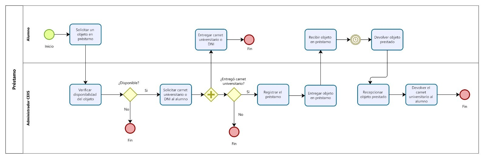
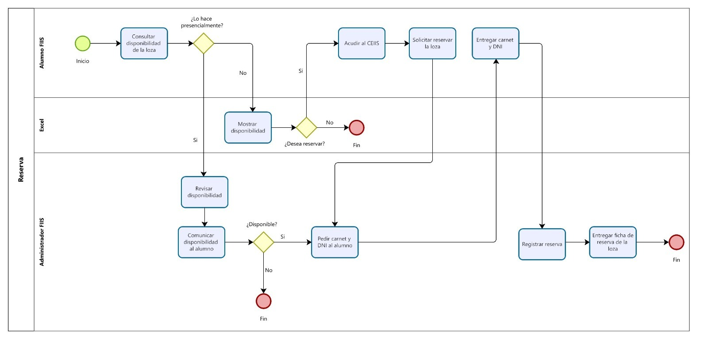

# DBD-Grupo-3
# "Implementación de software para el CEIIS"

## 1. Descripción de la Empresa, del Proceso de Negocio Elegido y Motivación
### 1.1 Descripción de la empresa
**1.1.1 Datos generales:**

**- Nombre de la empresa:** Centro de Estudiantes de Ingeniería Industrial y de Sistemas (CEIIS).

**-Tipo empresa:** Organización sin fines de lucro.

**-Función:** El CEIIS es el máximo órgano representativo de todos los estudiantes de la Facultad de Ingeniería Industrial, Sistemas y Software.

**Pagina de facebook:** [Facebook CEIIS](https://www.facebook.com/ceiis.oficial)
### 1.2 Procesos internos de la empresa

1.2.1 Proceso de alquiler

El proceso actual de alquiler comienza cuando un estudiante consulta la disponibilidad del juego (ping pong, futbito de mesa, etc), el encargado del CEIIS revisará su registro de alquiler y comunicará al estudiante si el juego se encuentra reservado o no. En caso de que el juego esté disponible, el encargado del CEIIS le solicita su carnet al estudiante, a continuación realiza el cobro del costo del juego, una vez realizado el pago se hace entrega de los accesorios del juego. El estudiante recibe los accesorios, al terminar el tiempo del alquiler (1 hora) el estudiante se acerca al CEIIS para hacer la devolución de los accesorios al encargado del CEIIS, se realiza la devolución del carnet de estudiante y el proceso termina.

1.2.2 Proceso de préstamo

Actualmente el proceso de préstamos empieza cuando solicita en préstamo un objeto al CEIIS, el encagado verificará la disponibilidad del obejto, en caso se encuentre disponible solicitará el carnet universitario al estudiante para poder registrar el préstamo y entregar el objeto. El estudiante recibe el objeto prestado, despues de un par de horas el estudiante se dirige al CEIIS para hacer la devolcuón del objeto prestado y recoger su carnet universitario para finalizar el proceso.

1.2.3 Proceso de venta

El proceso de venta actualmente inicia cuando el estudiante consulta si hay existencia del producto que desea comprar, el administrador revisa la existencia, en caso de que si haya le indica el precio al estudiando para que realice el pago, una vez realizado el pago el administrador hace entrega del objeto vendido y registra la venta en su cuaderno de ventas.

1.2.4 Proceso de reserva de lozas

El proceso de reserva de las lozas deportivas empieza cuando el estudiante consulta la disponibilidad de las lozas, ya sea de forma presencial o mediante un excel compartido por el administrador del CEIIS. Para realizar la reserva de la loza, de máximo 2 horas por hora, el administrador solicita el DNI y el carnet universitario del estudiante, después de que el estudiante entregó los documentos solicitados el administrador registra la reserva y le entrega al estudiante una ficha de reserva para respaldar al estudiante en caso de que otra persona ocupe la loza deportiva en las horas de su reserva.

### 1.3 Diagrama de Procesos
- Proceso de alquiler

- Proceso de préstamo

- Proceso de ventas

- Proceso de reserva

### 1.4 Descripcion del tema

Nuestro proyecto para este curso se enfoca en el desarrollo de un software para el Centro de estudiantes de la FIIS que permita optimizar y automatizar los procesos de préstamos, alquileres de objetos o juegos de mesa y reservas de las lozas deportivas de nuestra facultad. Este sistema proporcionará una plataforma eficiente para que los estudiantes de la facultad podamos acceder a estos recrsos de manera sencilla, mejoran la disponibilidad y facilitando la coordinación de actividades dentro de la comunidad FIIS.

### 1.5 Motivación del trabajo

La motivación para realizar este trabajo se basa en el deseo de desarrollar un software que mejora la experiencia de los estudiantes de la facultad, a la misma vez de ayudar al CEIIS a automatizar y optimizar sus procesos, para un mejor aprovechamiento de los recursos que ofrece y beneficiar directamente a los estudiantes al hacer que estos recursos y servicios sean más accesibles y eficientes,

**- Objetivo:** Mejorar la experiencia de los estudiantes de la FIIS, a la vez de optimizar la gestion de los recursos del CEIIS y asi mismo aumentar la eficiencia del personal aministrativo del centro de estudiantes de la FIIS.

## 2. Requerimientos

### 2.1 Requerimientos funcionales
**Caso de uso N°1: Registro de usuario**

| Objetivo | 
Permitir que los usuarios se registren proporcionando información personal y validar su registro.
 | 
|:--------------:|--------------|
| Descripción | Proceso de registro de usuarios en la aplicación, incluyendo la verificación de la información proporcionada y el envío de un correo de confirmación.  | 
| Actor primario   | Alumno FIIS  | 
|Actor secundario| - |
|Precondiciones | El correo institucional no tiene que estar vinculada a una cuenta ya existente |
| Paso | 
 Acción 
 |
| 1 | El usuario accede a la página de registro de la aplicación |
| 2 | El sistema muestra en pantalla los campos que el usuario debe ingresar para poder registrarse |
| 3	| El usuario ingresa sus nombres, apellidos, correo institucional, código universitario y contraseña |
| 4 | El usuario selecciona "Crear cuenta" |
| 5	| El sistema verifica la validez de la información proporcionada |
| 6	| El sistema registra al usuario en la base de datos |
| 7	| El sistema confirma de la creación de la cuenta mostrandola en pantalla |
| 8 | El caso termina |
  
**Caso de uso N°2: Login de usuario**

| Objetivo | 
Permitir que los usuarios registrados inicien sesión en la aplicación y accedan a sus perfiles. 
 | 
|:--------------:|--------------|
| Descripción |   | 
| Actor primario   | Alumno FIIS o Administrador | 
|Actor secundario| - |
|Precondiciones | El usuario debe estar registrado en la aplicación. |
| Paso | 
 Acción 
 |
| 1 | El usuario accede a la página de inicio de sesión de la aplicación. |
| 2 | El sistema muestra en pantalla los campos que el usuario debe llenar para poder iniciar sesión junto con la opcion "Recuerdame" | 
| 3	| El usuario proporciona su correo institucional y contraseña en los campos de usuario correspondientes y selecciona "Iniciar sesión" |
| 4	| El sistema verifica las credenciales del usuario para asegurarse de que sean válidas y coincidan en la base de datos |
| 5	| El sistema redirige al usuario a su perfil con las funcionalidades correspondientes a su rol |
| 6 | El caso termina |

**Caso de uso N°3: Olvido de contraseña**

| Objetivo | 
 Permitir que los usuarios registrados puedan iniciar sesión en caso de que hayan olvidado su contraseña. 
 | 
|:--------------:|--------------|
| Descripción | Proceso de recuperacíon de la cuenta en caso de olvidar su contraseña | 
| Actor primario   | Alumno FIIS o Administrador | 
|Actor secundario| - |
|Precondiciones | El usuario debe estar registrado en la aplicación. |
| Paso | 
 Acción 
 |
| 1 | El usuario accede a la página de inicio de sesión de la aplicación. |
| 2 | El usuario selecciona la opción "Recuperar Contraseña" para iniciar el proceso de recuperación. |
| 3 | El sistema envía un correo de confirmación al usuario |
| 4 | El usuario realiza la confirmación desde su correo |
| 5 | El sistema muestra en pantalla los campos que el usuario debe llenar para reestablecer su contraseña |
| 6 | El usuario llena los campos y selecciona "Reestablecer tu contraseña" |
| 7 | El sistema actualiza los cambios generados por el usuario |
| 8 | El sistema muestra en pantalla el perfil del usuario |
| 9 | El caso termina |

**Caso de uso N°4: Cambio de contraseña**

| Objetivo | 
 Permitir que los usuarios registrados puedan realizar su cambio de contraseña 
 | 
|:--------------:|--------------|
| Descripción | Proceso en el cual se puede modificar la contraseña actual ingresando la contraseña anterior| 
| Actor primario   | Alumno FIIS o Administrador | 
|Actor secundario| - |
|Precondiciones | El usuario debe estar registrado en la aplicación. |
| 1  | El usuario accede a la página de inicio de sesión de la aplicación.  |
| 2  | El alumno ingresa su correo y su contraseña  |
| 3  | El sistema verifica las credenciales del usuario para asegurarse de que sean válidas y coincidan en la base de datos.  |
| 4  | El alumno hace clic sobre el icono del perfil  |
| 5  | El sistema muestra el perfil del alumno |
| 6  | El alumno presiona sobre el botón de configuración |
| 7  | El alumno ingresa su contraseña actual y luego ingresa una contraseña nueva para después confirmarla  |
| 8  | El alumno presiona sobre el botón de cambiar contraseña  |
| 9  | El sistema verifica que la primera contraseña coincida con la contraseña anterior |
| 10  | El sistema verifica que la nueva contraseña no sea igual que el anterior  |
| 11 | El sistema cambia la nueva contraseña  |
| 12 | El caso termina  |

**Caso de uso N°5: Editar contacto**

| Objetivo | 
 Permitir que los usuarios registrados puedan actualizar su información de contacto d
 | 
|:--------------:|--------------|
| Descripción | Proceso en el cual se puede actualizar la información de contacto que incluyen el número de celular y correo| 
| Actor primario   | Alumno FIIS o Administrador | 
|Actor secundario| - |
|Precondiciones | El usuario debe estar registrado en la aplicación. |
| 1  | El usuario accede a la página de inicio de sesión de la aplicación.  |
| 2  | El alumno ingresa su correo y su contraseña  |
| 3  | El sistema verifica las credenciales del usuario para asegurarse de que sean válidas y coincidan en la base de datos.  |
| 4  | El alumno hace clic sobre el icono del perfil  |
| 5  | El sistema muestra el perfil del alumno |
| 6  | El alumno presiona sobre el botón de editar |
| 7  | El sistema muestra la ventana de editar de contacto  |
| 8  | El alumno ingresa su celular y correo  |
| 9  | El sistema verifica el celular y correo sean válidos |
| 10  | El sistema actualiza los nuevos datos  |
| 12 | El caso termina  |

**Caso de uso N°6: Visualizador de noticias**
  
| Objetivo    | Mostrar al estudiante las noticias más recientes que suceden en la FIIS |
| :-------------: | ------------- |
| Descripción  | Visualización actualizada de las últimas noticias que hay en la FIIS  |
| Actor primario  | Alumno FIIS  |
| Actores secundarios  | -  |
| Precondiciones  | Content Cell  |
| Paso  | Acción |
| 1  | El usuario accede a la página de inicio de sesión de la aplicación.  |
| 2  | El alumno ingresa su correo y su contraseña  |
| 3  | El sistema verifica las credenciales del usuario para asegurarse de que sean válidas y coincidan en la base de datos.  |
| 4  | El alumno hace clic sobre Ver noticias  |
| 5  | El sistema muestra las noticias más recientes  |
| 6  | El caso termina  |

**Caso de uso N°7: Reserva de lozas deportivas** 

| Objetivo | 
Realizar la reserva de una loza deportiva
 | 
|:--------------:|--------------|
| Descripción | Proceso para reservar una loza deportiva que este diponible en la FIIS  | 
| Actor primario   | Alumno FIIS | 
|Actor secundario| - |
|Precondiciones | El usuario debe estar registrado en la aplicación y debe estar apto para realizar reservas(buena reputación) |
| Paso | 
 Acción 
 |
| 1 | El alumno accede a la página de inicio de sesión de la aplicación. |
| 2	| El alumno ingresa su correo y su contraseña |
| 3	| El sistema verifica las credenciales del usuario para asegurarse de que sean válidas y coincidan en la base de datos. |
| 4 | El alumno ingresa a la opcion de servicios|
| 5 | El sistema muestra la pantalla de servicios |
| 6 | El alumno ingresa a la opción de reservas |
| 7 | El sistema muestra las opciones de reserva|
| 8 | El alumno presiona el boton de reservar de la opción que desea|
| 9 | El sistema presenta la pantalla de reservas|
| 10 | El alumno escoge la hora de inicio y las horas que desea reservar |
| 11 | El alumno presiona el botón de confirmar reserva |
| 12 | El sistema verifica que las horas esten disponibles y que la hora de reserva no excedan de 2 |
| 13 | El sistema muestra la confirmación de la reserva |
| 14 | El sistema actualiza el calendario de la pantalla de reservas |
| 15 | El sistema actualiza las reservas del alumno en su perfil |
| 16 | El sistema actualiza el historial general de servicios |
| 17 | El caso termina |

**Caso de uso N°8: Prestamos de objetos y materiales**

| Objetivo | 
Permitir que los usuarios registrados puedan solicitar y realizar préstamos de objetos y materiales disponibles en el CEIIS
 | 
|:--------------:|--------------|
| Descripción |  Proceso de préstamo de objetos y materiales, incluyendo la visualización del catálogo, la solicitud de préstamo, la confirmación del préstamo, la gestión de objetos no disponibles y el registro de préstamos y devoluciones. | 
| Actor primario   | Alumno FIIS | 
|Actor secundario| - |
|Precondiciones | El usuario debe haber iniciado sesión en la aplicación. |
| Paso | 
 Acción 
 |
| 1 | El alumno accede a la página de inicio de sesión de la aplicación. |
| 2	| El alumno ingresa su correo y su contraseña |
| 3	| El sistema verifica las credenciales del usuario para asegurarse de que sean válidas y coincidan en la base de datos. |
| 4 | El alumno ingresa a la opcion de servicios|
| 5 | El sistema muestra la pantalla de servicios |
| 6 | El alumno ingresa a la opción de préstamos |
| 7 | El sistema muestra las opciones de préstamo |
| 8 | El alumno presiona el boton "prestar" de la opción que desea|
| 9 | El sistema verifica que el recurso este disponibe |
| 10 | El sistema muestra la ventana de confirmación de préstamo |
| 11 | El alumno presiona sobre el boton confirmar |
| 12 | El sistema muestra la ventana de préstamo confirmado |
| 13 | El sistema actualiza el historial general de servicios |
| 14 | El alumno presiona el boton de inicio|
| 15 | El caso termina |

**Caso de uso N°9: Realizar compra de objetos**

| Objetivo | 
Permitir que los usuarios registrados puedan comprar objetos que vende en el CEIIS
 | 
|:--------------:|--------------|
| Descripción |  Proceso de compra de objetos que estan disponibles en el CEIIS. | 
| Actor primario   | Alumno FIIS | 
|Actor secundario| - |
|Precondiciones | El usuario debe haber iniciado sesión en la aplicación. |
| Paso | 
 Acción 
 |
| 1 | El alumno accede a la página de inicio de sesión de la aplicación. |
| 2	| El alumno ingresa su correo y su contraseña |
| 3	| El sistema verifica las credenciales del usuario para asegurarse de que sean válidas y coincidan en la base de datos. |
| 4 | El alumno ingresa a la opcion de servicios|
| 5 | El sistema muestra la pantalla de servicios |
| 6 | El alumno ingresa a la opción de ventas |
| 7 | El sistema muestra las opciones de venta|
| 8 | El alumno presiona el boton "comprar" de la opción que desea|
| 9 | El sistema verifica que el recurso este disponibe |
| 10 | El sistema muestra la ventana de confirmación de compra |
| 11 | El alumno presiona sobre el boton confirmar |
| 12 | El sistema muestra la ventana de compra confirmada |
| 13 | El sistema actualiza el historial general de servicios |
| 14 | El alumno presiona el boton de inicio|
| 15 | El caso termina |

**Caso de uso N°10: Visualizador de historial**

| Objetivo | 
 Permitir que los usuarios registrados accedan a un historial de sus actividades en la aplicación, incluyendo préstamos pasados, reservas anteriores y compras realizadas 
 | 
|:--------------:|--------------|
| Descripción |  Visualización del historial del usuario | 
| Actor primario   | Alumno FIIS | 
|Actor secundario| - |
|Precondiciones | El usuario debe haber iniciado sesión en la aplicación |
| Paso | 
 Acción 
 |
| 1 | El alumno accede a la página de inicio de sesión de la aplicación. |
| 2	| El alumno ingresa su correo y su contraseña |
| 3	| El sistema verifica las credenciales del usuario para asegurarse de que sean válidas y coincidan en la base de datos. |
| 4 | El usuario accede a su perfil |
| 5 | El sistema muestra el perfil del usuario |
| 6 | El usuario accede a la sección de historial de actividades |
| 7 | El sistema muestra en pantalla la seccion de historial de actividades |
| 8 | El sistema permite al usuario filtrar por fechas el historial de sus actividades |
| 9 | El usuario elige la fecha que desea visualizar |
| 10 | El sistema muestra la lista de actividades pasadas, incluyendo préstamos, reservas y compras especificando el tipo de servicio, la fecha , el costo y el estado actual |
| 11 | El caso termina  |

**Caso de uso N°11: Visualizar paginas "Acerca de nosotros"**

| Objetivo | 
 Permitir que los usuarios accedan y visualicen la página "Acerca de Nosotros", la cual proporciona información sobre el CEIIS, su junta directiva y su misión 
 | 
|:--------------:|--------------|
| Descripción |  Visualización de informacion relevante del CEIIS | 
| Actor primario   | Alumno FIIS | 
|Actor secundario| - |
|Precondiciones | - |
| Paso | 
 Acción 
 |
| 1 | El usuario inicia sesión en la aplicación o accede a la aplicación como visitante |
| 2 | El usuario va a la sección de la página principal de la aplicación |
| 3 | El sistema muestra la pagina de inicio de la aplicación |
| 3 | El usuario selecciona la opción "Acerca de Nosotros" en el menú de navegación o en la página principal |
| 4	| El sistema carga la página "Acerca de Nosotros" y muestra la información relacionada con el CEIIS |
| 5	| El usuario tiene la opción de regresar a la página principal de la aplicación o continuar explorando otros contenidos |
| 6 | El caso termina |

**Caso de uso N°12: Visualizar reputacion de usuario**

| Objetivo | 
 Permitir a los usuarios acceder y observar su reputación, lo cual podrá observar si tiene algina demora en algún prestamo 
 | 
|:--------------:|--------------|
| Descripción | Visualizar la repuatación de los usuarios | 
| Actor primario   | Alumons FIIS | 
|Actor secundario| - |
|Precondiciones | Los usarios registrados deben haber iniciado sesion |
| Paso | 
 Acción 
 |
| 1 | El usuario inicia sesión en la aplicación  |
| 2 | El ususario ingresa su correo y contreseña |
| 3 | El sistema verifica las credenciales del usuario para asegurarse de que sean válidas y coincidan en la base de datos |
| 4 | El sistema nos mostrará la relación de los prestamos realizados |
| 5 | EL usuario selecciona en "ver todo" |
| 6 | El sistema le mostrará la relacion al completo de los prestamos realizados, con ello verificar su reputación|
| 7 | El usario podra observar su reputación con un simbolo con su respectiva descripción, si tiene buena reputación, decente reputacion y mala reputación |
| 8| El caso termina |

**Caso de uso N°13: Creación de encuestas**

| Objetivo | 
 Permitir a los administradores crear encuestas dirigidas a los usuarios y proporcionar retroalimentación sobre la calidad de los servicios, la experiencia de usuario y tener un sistema de análisis para resumir los resultados de las encuestas 
 | 
|:--------------:|--------------|
| Descripción | Proceso completo de encuestas a usuarios | 
| Actor primario   | Administrador | 
|Actor secundario| Alumno FIIS |
|Precondiciones | El administrador debe estar registrado en la aplicación|
| Paso | 
 Acción 
 |
| 1 | El administrador accede a la página de inicio de sesión de la aplicación. |
| 2	| El administrador ingresa su correo y su contraseña |
| 3	| El sistema verifica las credenciales del usuario para asegurarse de que sean válidas y coincidan en la base de datos |
| 4 | El administrador accede a la sección Encuestas |
| 5 | El sistema muestra la sección de crear encuestas | 
| 6 | El sistema permite al administrador crear una nueva encuesta especificando preguntas y opciones de respuesta |
| 7	| El administrador establece la fecha de inicio y finalización de la encuesta |
| 8	| El sistema guarda la encuesta y la pública para que los usuarios puedan responder |
| 9 | El caso termina |

**Caso de uso N°14: Encuestas a usuarios**

| Objetivo | 
 Permite a los usuarios responder a las encuestas y proporcionar sugerencias 
 | 
|:--------------:|--------------|
| Descripción | Registro de las respuestas brindadas por los usuarios | 
| Actor primario | Alumno FIIS | 
|Actor secundario| - |
|Precondiciones | Los usuarios registrados deben haber iniciado sesión |
| Paso | 
 Acción 
 |
| 1 | El alumno accede a la página de inicio de sesión de la aplicación. |
| 2	| El alumno ingresa su correo y su contraseña |
| 3	| El sistema verifica las credenciales del usuario para asegurarse de que sean válidas y coincidan en la base de datos. |
| 4 | El usuario selecciona la sección de "Encuestas" |
| 5 | El sistema muestra en pantalla la seccion "Encuestas" |
| 6 | El sistema muestra las encuestas pendientes y la opcion de ver las encuestas respondidas anteriormente |
| 7 | El usuario selecciona la encuesta del apartado "Encuestas pendientes" y responde a las preguntas proporcionando retroalimentación |
| 8 | El sistema registra sus respuestas |
| 9 | El usuario podrá ver todas sus encuestas respondidas en el apartado "Encuestas Realizadas" |
| 10 | El caso termina |

**Caso de uso N°15: Visualizar estadisticas**

| Objetivo | 
  Permitir a los administradores acceder y visualizar estadísticas relacionadas con las actividades y el uso de recursos en la aplicación. 
 | 
|:--------------:|--------------|
| Descripción | Proceso mediante el cual los administradores pueden acceder a estadísticas y datos relevantes para evaluar el rendimiento y la utilización de los recursos en la aplicación. | 
| Actor primario | Administrador | 
|Actor secundario| - |
|Precondiciones | El administrador debe estar registrado en la aplicación |
| Paso | 
 Acción 
 |
| 1 | El administrador accede a la página de inicio de sesión de la aplicación. |
| 2	| El administrador ingresa su correo y su contraseña |
| 3	| El sistema verifica las credenciales del usuario para asegurarse de que sean válidas y coincidan en la base de datos |
| 4 | El administrador ingresa a la seccion de estadisticas |
| 5 | El sistema muestra la sección de estadisticas y permite seleccionar una fecha especifica para ver las estadisticas |
| 6 | El administrador selecciona una fecha específica para las ver estadísticas |
| 7 | El sistema muestra una variedad de estadísticas, como la cantidad de préstamos realizados, la ocupación de las lozas deportivas, la cantidad de ventas realizadas, etc |
| 8 | El caso termina |

**Caso de uso N°16: Visualizar finanzas**

| Objetivo | 
  Permitir a los administradores acceder y visualizar las finanzas relacionadas con la venta, prestamos y alquileres, con su diagrama. 
 | 
|:--------------:|--------------|
| Descripción | Proceso mediante el cual los administradores pueden acceder a las finanzas y datos relevantes para evaluar la utlización de los recursos. | 
| Actor primario | Administrador | 
|Actor secundario| - |
|Precondiciones | El administrador debe estar registrado en la aplicación |
| Paso | 
 Acción 
 |
| 1 | El administrador accede a la página de inicio de sesión de la aplicación. |
| 2	| El administrador ingresa su correo y su contraseña |
| 3	| El sistema verifica las credenciales del usuario para asegurarse de que sean válidas y coincidan en la base de datos |
| 4 | El administrador ingresa a la seccion de Finanzas |
| 5 | El sistema muestra la sección de Finanzas y permite seleccionar una fecha específica para ver las finanzas |
| 6 | El administrador selecciona una fecha específica para ver la relación de los alquileres realizados, y de los recuros vendidos y/o prestados |
| 6 | El sistema muestra un historial por cada servicio alquilado, vendido y prestado |
| 7 | El sistema nos muestra, si es alquiler nos muestra si ya esta finalizodo o no, en caso de préstamo si esta devuelto o no. |
| 8 | El sustema nos muestra cuanto se recuadó en ventas, alquileres, préstamos y totalidad de los recaudado |
| 9 | El caso termina |

**Caso de uso N°17: Visualizar Respuestas y Estadísticas**

| Objetivo | 
  Permitir a los administradores acceder y visualizar las respuestas marcadas, para observar la mayor demanda, con su diagrama. 
 | 
|:--------------:|--------------|
| Descripción | Proceso mediante el cual los administradores pueden acceder a las respuestas, y saber que producto esta en mayor demanda. | 
| Actor primario | Administrador | 
|Actor secundario| - |
|Precondiciones | El administrador debe estar registrado en la aplicación |
| Paso | 
 Acción 
 |
| 1 | El administrador accede a la página de inicio de sesión de la aplicación. |
| 2	| El administrador ingresa su correo y su contraseña |
| 3	| El sistema verifica las credenciales del usuario para asegurarse de que sean válidas y coincidan en la base de datos |
| 4 | El administrador ingresa a la seccion de Estadisticas |
| 5 | El sistema muestra la sección de estadísticas y permite visualizar la relacion de las repuestas, donde hay mas demanda de cada pregunta |
| 6 | Se visualizará un diagram de barras para que sea mas amigable la presentación |
| 7 | El caso termina |

**Caso de uso N°18: Control de horario de lozas deportivas**

| Objetivo | 
 Gestionar los hoararios de las lozas deportivas 
 | 
|:--------------:|--------------|
| Descripción | Proceso en el cual los administradores cambian la disponibilidad de los horarios dependiendo de la hora y día| 
| Actor primario | Administrador | 
|Actor secundario| - |
|Precondiciones | El administrador debe haber iniciado sesión |
| Paso | 
 Acción 
 |
| 1 | El administrador accede a la página de inicio de sesión de la aplicación. |
| 2	| El administrador ingresa su correo y su contraseña |
| 3	| El sistema verifica las credenciales del usuario para asegurarse de que sean válidas y coincidan en la base de datos |
| 4	| El administrador presiona sobre el icono de perfil |
| 5	| El sistema muestra la pantalla del perfil del administrador |
| 6	| El administrador presiona sobre el boton reservas/alquiler |
| 7	| El sistema muestra la ventana de vista de alquiler |
| 8	| El administrador presiona sobre el boton editar |
| 9	| El sistema coloca en cada casilla del horario un boton de cambio |
| 10 | El administrador presiona el boton de cambio sobre los horarios que desea modificar |
| 11 | El sistema cambia los colores de los casilleros|
| 12	| El sistema cambia los horarios disponibles en la ventana horarios de reserva |
| 13	| El caso termina |

**Caso de uso N°19: Quitar articulo de inventario de ventas**

| Objetivo | 
 Deshacerse de los articulos que ya no se encuentran disponibles para vender  
 | 
|:--------------:|--------------|
| Descripción | Proceso en el cual los administradores quitan los articulos que ya no estan disponibles a través de su perfil de administradores | 
| Actor primario | Administrador | 
|Actor secundario| - |
|Precondiciones | El administrador debe haber iniciado sesión |
| Paso | 
 Acción 
 |
| 1 | El administrador accede a la página de inicio de sesión de la aplicación. |
| 2	| El administrador ingresa su correo y su contraseña |
| 3	| El sistema verifica las credenciales del usuario para asegurarse de que sean válidas y coincidan en la base de datos |
| 4	| El administrador presiona sobre el icono de perfil |
| 5	| El sistema muestra la pantalla del perfil del administrador |
| 6	| El administrador presiona sobre el boton ventas |
| 7	| El sistema muestra la ventana de inventario de ventas |
| 8	| El administrador presiona sobre el boton quitar artículo |
| 9	| El sistema coloca en cada articulo un icono de una papelera |
| 10 | El administrador presiona el boton de la papelera del articulo que desea eliminar |
| 11 | El sistema quita el articulo|
| 12	| El sistema quita el articulo de la ventana de ventas |
| 13	| El caso termina |

**Caso de uso N°20: Agregar articulo de inventario de ventas**

| Objetivo | 
 Agregar articulos nuevos para poder vender  
 | 
|:--------------:|--------------|
| Descripción | Proceso en el cual los administradores agregan articulos nuevos a través de su perfil de administradores | 
| Actor primario | Administrador | 
|Actor secundario| - |
|Precondiciones | El administrador debe haber iniciado sesión |
| Paso | 
 Acción 
 |
| 1 | El administrador accede a la página de inicio de sesión de la aplicación. |
| 2	| El administrador ingresa su correo y su contraseña |
| 3	| El sistema verifica las credenciales del usuario para asegurarse de que sean válidas y coincidan en la base de datos |
| 4	| El administrador presiona sobre el icono de perfil |
| 5	| El sistema muestra la pantalla del perfil del administrador |
| 6	| El administrador presiona sobre el boton ventas |
| 7	| El sistema muestra la ventana de inventario de ventas |
| 8	| El administrador presiona sobre el boton agregar artículos |
| 9	| El sistema agrega una nueva casilla |
| 10 | El administrador ingresa el nombre, el precio y el stock del articulo |
| 11 | El administrador presiona el check para confirmar|
| 12	| El sistema agrega el articulo |
| 13	| El sistema agrega el articulo a la ventana de ventas |
| 13	| El caso termina |

**Caso de uso N°21: Editar articulo de inventario de ventas**

| Objetivo | 
 Editar los articulos disponibles para vender  
 | 
|:--------------:|--------------|
| Descripción | Proceso en el cual los administradores editan el total de stock de los artículos en venta a través de su perfil de administradores | 
| Actor primario | Administrador | 
|Actor secundario| - |
|Precondiciones | El administrador debe haber iniciado sesión |
| Paso | 
 Acción 
 |
| 1 | El administrador accede a la página de inicio de sesión de la aplicación. |
| 2	| El administrador ingresa su correo y su contraseña |
| 3	| El sistema verifica las credenciales del usuario para asegurarse de que sean válidas y coincidan en la base de datos |
| 4	| El administrador presiona sobre el icono de perfil |
| 5	| El sistema muestra la pantalla del perfil del administrador |
| 6	| El administrador presiona sobre el boton ventas |
| 7	| El sistema muestra la ventana de inventario de ventas |
| 8	| El administrador presiona sobre el boton editar|
| 9	| El administrador modifica el stock del articulo |
| 10 | El administrador presiona el check para confirmar|
| 11	| El sistema modifica el stock |
| 12	| El caso termina |

**Caso de uso N°22: Quitar articulo de inventario de prestamos**

| Objetivo | 
 Deshacerse de los articulos que ya no se encuentran disponibles para prestar  
 | 
|:--------------:|--------------|
| Descripción | Proceso en el cual los administradores quitan los articulos que ya no estan disponibles a través de su perfil de administradores | 
| Actor primario | Administrador | 
|Actor secundario| - |
|Precondiciones | El administrador debe haber iniciado sesión  |
| Paso | 
 Acción 
 |
| 1 | El administrador accede a la página de inicio de sesión de la aplicación. |
| 2	| El administrador ingresa su correo y su contraseña |
| 3	| El sistema verifica las credenciales del usuario para asegurarse de que sean válidas y coincidan en la base de datos |
| 4	| El administrador presiona sobre el icono de perfil |
| 5	| El sistema muestra la pantalla del perfil del administrador |
| 6	| El administrador presiona sobre el boton préstamos |
| 7	| El sistema muestra la ventana de inventario de préstamos |
| 8	| El administrador presiona sobre el boton quitar artículo |
| 9	| El sistema coloca en cada articulo un icono de una papelera |
| 10 | El administrador presiona el boton de la papelera del articulo que desea eliminar |
| 11 | El sistema quita el articulo|
| 12	| El sistema quita el articulo de la ventana de prestamos |
| 13	| El caso termina |

**Caso de uso N°23: Agregar articulo de inventario de préstamos**

| Objetivo | 
 Agregar articulos nuevos para poder prestar  
 | 
|:--------------:|--------------|
| Descripción | Proceso en el cual los administradores agregan articulos nuevos a través de su perfil de administradores | 
| Actor primario | Administrador | 
|Actor secundario| - |
|Precondiciones | El administrador debe haber iniciado sesión |
| Paso | 
 Acción 
 |
| 1 | El administrador accede a la página de inicio de sesión de la aplicación. |
| 2	| El administrador ingresa su correo y su contraseña |
| 3	| El sistema verifica las credenciales del usuario para asegurarse de que sean válidas y coincidan en la base de datos |
| 4	| El administrador presiona sobre el icono de perfil |
| 5	| El sistema muestra la pantalla del perfil del administrador |
| 6	| El administrador presiona sobre el boton prestamos|
| 7	| El sistema muestra la ventana de inventario de préstamos |
| 8	| El administrador presiona sobre el boton agregar artículos |
| 9	| El sistema agrega una nueva casilla |
| 10 | El administrador ingresa el nombre y el stock del articulo |
| 11 | El administrador presiona el check para confirmar|
| 12	| El sistema agrega el articulo |
| 13	| El sistema agrega el articulo a la ventana de prestamos |
| 13	| El caso termina |

**Caso de uso N°24: Editar articulo de inventario de préstamos**

| Objetivo | 
 Editar los articulos disponibles para prestar  
 | 
|:--------------:|--------------|
| Descripción | Proceso en el cual los administradores editan el total de stock de los artículos prestables a través de su perfil de administradores | 
| Actor primario | Administrador | 
|Actor secundario| - |
|Precondiciones | El administrador debe haber iniciado sesión |
| Paso | 
 Acción 
 |
| 1 | El administrador accede a la página de inicio de sesión de la aplicación. |
| 2	| El administrador ingresa su correo y su contraseña |
| 3	| El sistema verifica las credenciales del usuario para asegurarse de que sean válidas y coincidan en la base de datos |
| 4	| El administrador presiona sobre el icono de perfil |
| 5	| El sistema muestra la pantalla del perfil del administrador |
| 6	| El administrador presiona sobre el boton préstamos |
| 7	| El sistema muestra la ventana de inventario de préstamos |
| 8	| El administrador presiona sobre el boton editar|
| 9	| El administrador modifica el stock del articulo |
| 10 | El administrador presiona el check para confirmar|
| 11	| El sistema modifica el stock |
| 12	| El caso termina |

**Caso de uso N°25: Actualización de noticias**

| Objetivo | 
 Permitir que los administradores tengan un mejor manejo en las publicaciones de las noticias, para el mejor entendimiento de los alumnos 
 | 
|:--------------:|--------------|
| Descripción | Permitir a los administradores puedan agregar, modificar o aliminar noticias | 
| Actor primario   | Administrador | 
|Actor secundario| Alumno FIIS |
|Precondiciones | Los administradores deben haber iniciado sesión |
| Paso | 
 Acción 
 |
| 1 | El administrador inicia sesión en la aplicación  |
| 2 | El administrador accede a la sección Home Page |
| 3 | El administrador se dirige al seccion de noticias |
| 4	| El administrador presiona el boton de ver noticias |
| 5	| El administrador agregará las noticias con la imagen y su descripcion |
| 6 | Después de terminar la acción el sistema peridrá la confirmacion de lo que se agregó |
| 7 | El admintrador tendrá la opción de editar la noticia |
| 8 | Después de terminar la acción el sistema peridrá la confirmacion de lo que se editó|
| 9 | El admintrador tendrá la opción de eliminar la noticia |
| 10 | Después de terminar la acción el sistema peridrá la confirmacion de lo que se quiere aliminar|
| 11 | El sstema después de las acciones anteriores se publicará la noticia |
| 12 | Se pdrá regresar a la página principal  con el botón de servicios |
| 13 | El caso termina |

**Caso de uso N°26: Confirmar deudas**

| Objetivo | 
 Permitir que los administradores confirmen si un alumno cancelo una deuda 
 | 
|:--------------:|--------------|
| Descripción | Permitir a los administradores puedan agregar, modificar o aliminar noticias | 
| Actor primario   | Administrador | 
|Actor secundario| Alumno FIIS |
|Precondiciones | Los administradores deben haber iniciado sesión |
| Paso | 
 Acción 
 |
| 1 | El administrador accede a la página de inicio de sesión de la aplicación. |
| 2	| El administrador ingresa su correo y su contraseña |
| 3	| El sistema verifica las credenciales del usuario para asegurarse de que sean válidas y coincidan en la base de datos |
| 4	| El administrador presiona sobre el icono de perfil |
| 5	| El sistema muestra la pantalla del perfil del administrador |
| 6	| El administrador presiona sobre el boton deudas pendientes |
| 7	| El sistema muestra la ventana de deudas pendientes|
| 8	| El administrador presiona sobre el botón pagar del alumno que ha cancelado|
| 9	| El sistema muestra la ventana de confirmación de pago |
| 10 | El administrador escoge la opción por el cual el alumno pago|
| 11	| El sistema muestra la ventana de confirmación de pago|
| 12	| El alumno presiona sobre el boton de cerrar |
| 11	| El sistema actualiza las deudas pendientes|
| 12	| El caso termina|
### 2.2 Requerimientos de atributos

- Seguridad: La página controlará el acceso solo de las personas que cuenten con una cuenta en el sistema, además distinguirá 2 tipos de usuarios para el sistema, los cuales tienen acceso a diferentes opciones dependiendo del tipo de usuario.
  
- Usabilidad : La usabilidad es esencial para que tanto los administradores como los alumnos interactúen facilmente con el sistema, y permita optimizar el proceso de obtención de información necesaria especialmente para los administradores.
  
- Rendimiento: Los recursos serán utilidados con eficacia para que el sistema pueda garantizar un correcto procesamiento de grandes cantidades de datos y generar información de manera rápida y eficiente.
  
- Automatizacion de procesos: El sistema permitirá automatizar procesos para los administradores, optimizando el uso de los recursos y mejorando la eficiencia operativa del CEIS.
  
- Escalabilidad: La página será capaz de soportar una gran cantidad de usuarios y operaciones.
## 3. Módulos

### 3.1 Módulos por funcionalidad

**- Seguridad**
  - Responsabilidades: Gestionar todo inicio de sesión, registro y recuperación de contraseñas de la pagina asi mismo de la seguridad de la integración de las cuentas, y el acceso a los campos respectivo de cada usuario y contraseña.
    
  - Interacción:Con el módulo prestamos o alquiler, encuestas, finanzas, estadistica y logistica.
    
    **A. Registro**
    
    **Responsabilidades:** Permite que los usuarios de la facultad creen una cuenta personal en el sistema. Su función principal es recopilar la información necesaria para crear una cuenta de usuario, como los nombres, apellidos, codigo UNI, correo institucional, contraseña.
    
    **B. Login**
    
    **Responsabilidades:** Permite que los usuarios ingresen a su cuenta personal proporcionando sus credenciales de autenticación, en este caso su correo institucional y su contraseña.

    **C. Recuperar cuenta**
    
    **Responsabilidades:** Proporciona a los usuarios una forma de restablecer el acceso a su cuenta personal en caso de que hayan olvidado su contraseña o enfrenten problemas para iniciar sesión.

    **D. Reestablecer contraseña**
    
    **Responsabilidades:** Permite a los usuarios cambiar su contraseña actual por una nueva en caso de olvido.

    **E. Perfil del usuario**

    **Responsabilidades:** Permite a los usuarios gestionar y actualizar la información relacionada con su perfil personal en la plataforma.
    
    
    **F. Cambiar contraseña**

    **Responsabilidades:** Permite a los usuarios cambiar su contraseña actual por una nueva.
    
    **G. Historial del usuario**

    **Responsabilidades:** Muestra a los usuarios un registro detallado de los prestamos, alquileres o reservas que han realizado dentro de la plataforma a lo largo del tiempo. Esta funcionalidad proporciona a los usuarios un resumen histórico de su actividad y les permite realizar un seguimiento de sus interacciones pasadas. 

    **H. Perfil del administrador**
    
    **Responsabilidades:** Permite a los administradores gestionar y actualizar la información relacionada con su perfil personal en la plataforma, además de ingresar a las vistas de finanzas, estadisticas, encuestas, préstamos, alquiler, reserva y ventas.
    
**-   Encuestas**

- Responsabilidades: Gestionar las preguntas que se pondran para hacer un cuestionario a los alumnos, para reacuadar información a travez de preguntas concisas, en base a alternativa  y a partir de la información recolectada poder hacer cuadros estadisticos, mostrando las tendencias de respuesta.
- Interaccion: Con el módulo de seguridad.

  **A. Administrador encuesta**  
    
    **Responsabilidades:** Permite gestionar y administrar todas las encuestas en la plataforma. Crear editar y elimnar las encestas, además de asignar los permisos para que los usuarios puedan acceder a la encuesta. 

  **B. Administrador crear encuesta**

    **Responsabilidades:** Permite al administrador definir los detalles de la encuesta, diseñar las preguntas, opciones de respuestas y lógica de encuesta. 

  **C. Administrador respuestas y estadisticas encuestas**

    **Responsabilidades:** Permite acceder y analizar las respuestas de las encuestas y proporcionar información estadistica para la toma de decisiones.

  **D. Usuario encuesta**
    
    **Responsabilidades:** Permite al usuario participar en las encuestas creadas por los aministradores.

    
**-  Estadisticas:**

- Responsabilidades: A partir de todos los movimientos registrados, como alquileres y prestamos de objetos se puede elaborar, se pueda lograr una visualización de la cantidad de préstamos y alquieleres que se hicieron en la semana.

- Interacción: Con el módulo de finanzas, logística.
  
  **A. Panel de estadísticas**

  **Responsabilidades:** Permite a los administradores tener un conteo sobre sus productos o artículos más vendidos, más demandados en cuanto a préstamos y alquileres por semana. Además se dispone de algunos gráficos para que los administradores puedan analizar y tomar decisiones en base a ellas.
    
**-  Finanzas**

- Responsabilidades: Registrar y gestionar por parte de los administradores los datos de manera eficiente de las ganancias por ventas, préstamos y alquileres. Seguimiento del presupuesto asignado y disponible, actualizar de manera automatica el dinero. Generación de informes para auditorias.

- Interacción: Con el módulo de Seguridad, Logística, Estadísticas, Préstamos o Alquiler.

  **A. Panel de finanzas**

  **Responsabilidades:** Permite tener un registro de todas las transacciones realizadas por los usuarios respecto a ventas, alquileres y préstamos; así como un conteo de los ingresos generados por dichas transacciones y el balance general.

**-  Ventas, Préstamos y Alquileres**

- Responsabilidades: Permitie a los usuarios poder comprar artículos que ofrece el CEIIS (útiles escolares, fólderes, etc.), reservar zonas de entretenimiento (lozas deportivas, mesas de ping pong, futbol de mesa, etc.), pedir prestado artículos académicos (calculadoras, guardapolvos, etc.) y que el administrador pueda gestionar la disponibilidad de éstas.

- Interacción: Con el módulo de Seguridad, Logística, Finanzas.

**Para las ventas**

  **A. Sell page**
  
  **Responsabilidades:** Permite al usuario ordenar la compra de un artículo ofrecido por el CEIIS. Todo pago se realiza presencialmente en la oficina del CEIIS.

  **B. Confirmación de compra**
  
  **Responsabilidades:** Permite al usuario confirmar o cancelar la reserva de la compra del artículo.
  
   **C. Vista de compra confirmada**
  
  **Responsabilidades:** Muestra al usuario que su orden de compra fue procesada con éxito y le indique que se acerque al CEIIS para pagar y recoger el producto.
  
   **D. Vista de compra fallida**
  
  **Responsabilidades:** Muestra al usuario que su orden de compra ha fallado, ya porque ese producto no está disponible u otros motivos.

**Para las reservas**

**A. Reserva page**
  
  **Responsabilidades:** Permite al usuario poder reservar las lozas deportivas, las mesas de ping pong y la mesa de fulbito. Algunos tienen costo de reserva, otras son gratuitas. Todo pago se realiza presencialmente en la oficina del CEIIS.

  **B. Horarios de reserva**
  
  **Responsabilidades:** Permite al usuario realizar la reserva, tanto de lozas deportivas como de mesas de ping pong o mesa de fulbito, en cierto día y a cierta hora, así como su disponibilidad. Se debe inficar la hora de inicio y elegir la cantidad de horas que se desee reservar (máximo 2 horas por código).
  
  **C. Reserva confirmada**
  
  **Responsabilidades:** Muestra al usuario que su reserva ha sido exitosa.
  
  **D. Reserva fallida**
  
  **Responsabilidades:** Muestra al usuario que ha ocurrido un error con su reserva ya sea porque no está disponible u otros motivos.

**Para los préstamos**

  **A. Préstamos page**
  
  **Responsabilidades:** Muestra la variedad de productos que pueden ser prestados a los usuario. Además permite al usuario solicitar un préstamo de estos productos. Todos los productos pueden ser prestados como máximo hasta las 10:00 pm de lunes a viernes y hasta las 8:00 pm los sábados. No se permite que los usuarios se lleven los productos prestados a sus hogares. 

  **B. Confirmación de préstamo**
  
  **Responsabilidades:** Permite al usuario confirmar o cancelar la solicitud de préstamo de un artículo que ofrece el CEIIS.
  
  **C. Vista de préstamo confirmado**
  
  **Responsabilidades:** Muestra al usuario que su solicitud de préstamo ha sido exitosa y debe acercarse al CEIIS para recoger el artículo.
  
  **D. Vista de préstamo fallida**
  
  **Responsabilidades:** Muestra al usuario que ha ocurrido un error con su solicitud de préstamo y que debe volver a intentarlo.
    
**-  Logistica:**

- Responsabilidades: Gestionar y mantener actualizados el inventario de recursos y suministros disponibles. Validar la disponibilidad de los recursos solicitados. Se mantendria un registro detallado de las transacciones de los recursos.

- Interacción: Con el módulo de seguridad, finanzas, estadísticas, préstamos o alquiler.
  
**Para el inventario de ventas**

  **A. Vista de inventario de ventas**
  
  **Responsabilidades:** Muestra todos los artículos en el inventario de ventas, su cantidad de stock disponible y su precio unitario. Además muestra la cantidad de artículos vendidos.
  
  **B. Agregar artículo al inventario de ventas**
  
  **Responsabilidades:** Permite al administrador agregar un nuevo artículo al stock de inventario de ventas, con su nombre de artículo, precio unitario del artíclo y la cantidad de stock disponible.
  
  **C. Editar artículo del inventario de ventas**
  
  **Responsabilidades:** Permite al administrador modificar el precio unitario y la cantidad de stock disponible del artículo en el inventario de ventas.
  
  **D. Quitar artículo del inventario de ventas**
  
  **Responsabilidades:** Permite al administrador quitar un artículo del inventario de ventas.

**Para el inventario de préstamos**

  **A. Vista de inventario de préstamos**
  
  **Responsabilidades:** Muestra todos los artículos en el inventario de préstamos y su cantidad de stock disponible. Además muestra la cantidad de artículos prestados.

  **B. Agregar artículo al inventario de préstamos**
  
  **Responsabilidades:** Permite al administrador agregar un nuevo artículo al stock de inventario de préstamos, con su nombre de artículo y la cantidad de stock disponible.

  **C. Editar artículo del inventario de préstamos**
  
  **Responsabilidades:** Permite al administrador modificar la cantidad de stock disponible del artículo en el inventario de préstamos.
  
  **D. Quitar artículo del inventario de préstamos**
  
  **Responsabilidades:** Permite al administrador quitar un artículo del inventario de préstamos.

**Para el inventario de reservas**

  **A. Vista de alquiler de lozas**

  **Responsabilidades:** Permite al administrador ver las disponibilidades y estado actual de las lozas. También la opción de cambiar la disponibilidad de los horarios.

  **B. Editar disponibilidad de lozas**

  **Responsabilidades:** Permite al administrador cambiar la disponibilidad de las lozas.

  ### 3.2 Diagrama de paquetes UML
  

## 4. Prototipo 
[Figma](https://www.figma.com/file/600QmGXcDGzgKVtZu9jm7g/DBD-GRUPO3?type=design&node-id=38-6&mode=design&t=0TAzfWjCKlUIWavj-0)

## 5. Modelado Conceptual

[Link con el .ERDPLUS](https://unipe-my.sharepoint.com/:u:/g/personal/diego_andia_f_uni_pe/EayJrIx8kktNtEz_Jt1zU9UBWwiJICrZ-eHoCB80qL8Ytg?e=wnkQUU)

Regla de negocio:
1. El usuario solo puede pedir un prestamo a la vez, por reglas cel CEIIS

### 5.1 Diagrama Entidad-Relación

